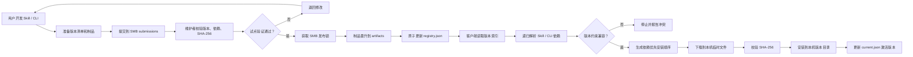
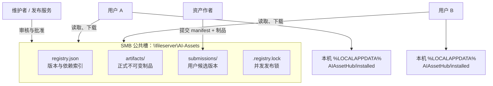
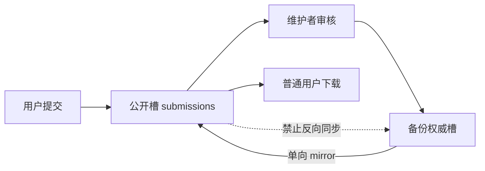

# 统一管理AI skill和CLI

- 会话 ID：`019f8c93-22e5-7703-b623-a3435666972a`
- 最后更新：2026-08-12T09:05:14.000Z
- 来源：Codex 本地会话

## 用户

<recommended_plugins>
Here is a list of plugins that are available but not installed.

- Atlassian Rovo (atlassian-rovo@openai-curated-remote)
- Box (box@openai-curated-remote)
- Figma (figma@openai-curated-remote)
- Google Calendar (google-calendar@openai-curated-remote)
- Notion (notion@openai-curated-remote)
- Outlook Calendar (outlook-calendar@openai-curated-remote)
- Outlook Email (outlook-email@openai-curated-remote)
- SharePoint (sharepoint@openai-curated-remote)
- Slack (slack@openai-curated-remote)
- Teams (teams@openai-curated-remote)
</recommended_plugins>
<environment_context>
  <cwd>C:\Users\lfaf-test\Documents\AI管理</cwd>
  <shell>powershell</shell>
  <current_date>2026-07-23</current_date>
  <timezone>Asia/Shanghai</timezone>
  <filesystem><workspace_roots><root>C:\Users\lfaf-test\Documents\AI管理</root></workspace_roots><permission_profile type="managed"><file_system type="restricted"><entry access="read"><special>:root</special></entry><entry access="write"><path>C:\Users\lfaf-test\Documents\AI管理</path></entry><entry access="write"><special>:slash_tmp</special></entry><entry access="write"><special>:tmpdir</special></entry><entry access="write"><path>C:\Users\lfaf-test\.codex\visualizations\2026\07\23\019f8c93-22e5-7703-b623-a3435666972a</path></entry><entry access="read"><path>C:\Users\lfaf-test\Documents\AI管理\.git</path></entry><entry access="read"><path>C:\Users\lfaf-test\Documents\AI管理\.agents</path></entry><entry access="read"><path>C:\Users\lfaf-test\Documents\AI管理\.codex</path></entry></file_system></permission_profile></filesystem>
</environment_context>

## 用户

我们多人都在用AI，有skill和cli需要进行统一管理，可以更新版本，skill之间，skill和cli之间如果有依赖关系也要清楚。

## 助手

我先盘点当前目录里已有的 CLI、Skill 和配置，再给出一套可落地的统一管理方案；如果这里已经有项目骨架，我会直接沿用并补齐版本、依赖和更新机制。

## 助手

当前仓库是空的。我会按“Git 作为唯一事实源 + 清单驱动 + 依赖图 + 可审计升级”的方向做一个轻量 MVP，先不绑定某个 AI 平台：既能统一登记 Skill/CLI，也能解析 `skill→skill`、`skill→CLI`、`CLI→CLI` 依赖，并支持检查与升级规划。默认用 Python 标准库，方便多人环境直接落地。

## 用户

目标用户可以提交自己的更新，可以下载应用不同版本更新，有依赖时自动下载

## 助手

收到，我把目标补成“自助发布 + 多版本安装/切换 + 递归依赖自动下载”。这会在当前目录清单基础上增加制品发布规范、可安装的版本索引，以及解析依赖后按拓扑顺序下载/安装的命令；提交更新会先进入可审核的候选状态。

## 助手

基础目录和依赖校验已经跑通。现在我在把“单一批准版本”扩展为版本仓库模型：同一资产保留多个 release，安装时选择指定版本并合并所有依赖约束；如果两个上游要求互相冲突，会在下载前直接报出冲突。

## 助手

多版本选择和下载流程已经接上，当前正在做端到端验证：会实际安装示例 Skill，确认其 CLI 依赖先下载、SHA-256 校验生效，并验证版本切换指针。之后我再检查 Git 差异，避免遗漏临时文件。

## 助手

已完成一个可运行的 Skill/CLI 统一管理 MVP，覆盖：

- 用户自助提交新版本，进入待审核区。
- 同一 Skill/CLI 并存多个版本。
- 指定稳定版或预览版下载。
- 自动解析并优先下载依赖。
- 支持 `Skill→Skill`、`Skill→CLI`、`CLI→CLI`。
- SHA-256 制品完整性校验。
- 多版本并排安装及快速切换。
- 版本冲突、缺失依赖、循环依赖检查。
- Git 评审、批准和回滚流程。

核心文件：

- [README.md](</C:/Users/lfaf-test/Documents/AI管理/README.md>)
- [registry.json](</C:/Users/lfaf-test/Documents/AI管理/registry.json>)
- [asset_hub.py](</C:/Users/lfaf-test/Documents/AI管理/tools/asset_hub.py>)
- [governance.md](</C:/Users/lfaf-test/Documents/AI管理/docs/governance.md>)
- [catalog.schema.json](</C:/Users/lfaf-test/Documents/AI管理/catalog.schema.json>)

常用命令：

```powershell
# 查看所有可用版本
python .\tools\asset_hub.py releases

# 安装指定 Skill，自动下载 CLI 等依赖并激活
python .\tools\asset_hub.py install skill/code-review@1.1.0 --activate

# 安装预览版本
python .\tools\asset_hub.py install cli/codex@1.4.0 --channel preview

# 切换到已安装版本
python .\tools\asset_hub.py activate cli/codex@1.3.0

# 用户提交自己的更新
python .\tools\asset_hub.py submit .\my-release.json

# 管理员审核后批准
python .\tools\asset_hub.py approve .\submissions\skill__name@1.2.0.json
```

已完成端到端验证：示例 Skill 能自动解析并先下载其 CLI 依赖，版本激活和 lock 检查正常，8 项自动化测试全部通过。当前采用本地文件模拟制品，正式部署时把 `artifact.location` 换成企业内网制品库 HTTPS 地址即可。

## 用户

<environment_context>
  <current_date>2026-07-23</current_date>
  <timezone>Asia/Shanghai</timezone>
  <filesystem><workspace_roots><root>C:\Users\lfaf-test\Documents\AI管理</root><root>C:\Users\lfaf-test\.codex\visualizations\2026\07\23\019f8c93-22e5-7703-b623-a3435666972a</root></workspace_roots><permission_profile type="managed"><file_system type="restricted"><entry access="read"><special>:root</special></entry><entry access="write"><path>C:\Users\lfaf-test\Documents\AI管理</path></entry><entry access="write"><path>C:\Users\lfaf-test\.codex\visualizations\2026\07\23\019f8c93-22e5-7703-b623-a3435666972a</path></entry><entry access="write"><special>:slash_tmp</special></entry><entry access="write"><special>:tmpdir</special></entry><entry access="read"><path>C:\Users\lfaf-test\Documents\AI管理\.git</path></entry><entry access="read"><path>C:\Users\lfaf-test\.codex\visualizations\2026\07\23\019f8c93-22e5-7703-b623-a3435666972a\.git</path></entry><entry access="read"><path>C:\Users\lfaf-test\Documents\AI管理\.agents</path></entry><entry access="read"><path>C:\Users\lfaf-test\.codex\visualizations\2026\07\23\019f8c93-22e5-7703-b623-a3435666972a\.agents</path></entry><entry access="read"><path>C:\Users\lfaf-test\Documents\AI管理\.codex</path></entry><entry access="read"><path>C:\Users\lfaf-test\.codex\visualizations\2026\07\23\019f8c93-22e5-7703-b623-a3435666972a\.codex</path></entry></file_system></permission_profile></filesystem>
</environment_context>

## 用户

我要多人共用，资料库肯定再smb公共槽

## 助手

对，多人共用时仓库应放在 SMB 公共槽，但安装目录和缓存必须留在每个人本机。我会把当前实现调整为“SMB 上存元数据、提交和制品，本机安装运行”，并补上 UNC 路径配置、并发写锁和原子更新，避免多人同时批准版本时覆盖数据。

## 助手

SMB 方案已落到实现里：公共槽仅保存索引、候选提交和不可变制品；客户端默认安装到 `%LOCALAPPDATA%`。现在我在复测显式仓库路径、自动依赖下载和本地切换，同时检查并发写保护没有破坏原有流程。

## 助手

已调整为适合多人共用的“SMB 公共仓库 + 本机安装”模式：

```text
\\fileserver\AI-Assets\
├─ registry.json    版本与依赖索引
├─ artifacts\       Skill/CLI 制品
├─ submissions\     用户提交的候选版本
└─ .registry.lock   并发更新锁

用户电脑：
%LOCALAPPDATA%\AIAssetHub\installed\
```

配置公共槽：

```powershell
$env:AI_ASSET_REPO = '\\fileserver\AI-Assets'

python .\tools\asset_hub.py releases
python .\tools\asset_hub.py install skill/code-review@1.1.0 --activate
```

当前实现已经支持：

- 从 SMB 自动下载目标版本及其全部依赖。
- SHA-256 校验，损坏或被替换的制品不会安装。
- Skill/CLI 多版本在本机并存和切换。
- 用户提交更新到 SMB 候选区。
- 管理员批准时使用 SMB 独占锁。
- 更新 `registry.json` 时采用临时文件原子替换，避免多人覆盖。
- 网络中断不会破坏本机原有安装。

权限上不建议把公共槽完全开放写入。普通用户只应读取仓库并在 `submissions` 新建文件；只有维护者能更新 `registry.json` 和正式制品。

完整部署和 ACL 建议见 [SMB 部署说明](</C:/Users/lfaf-test/Documents/AI管理/docs/smb-deployment.md>)，客户端实现在 [asset_hub.py](</C:/Users/lfaf-test/Documents/AI管理/tools/asset_hub.py>)。全部 8 项测试已通过。

## 用户

列出流程图谱和部署使用说明

## 助手

我会使用可视化能力把整体流程、依赖解析和部署拓扑整理成图谱，同时补充一份可直接交给管理员和普通用户执行的 SMB 部署使用说明。图谱会与现有命令保持一致。

## 助手

已整理成完整图谱和操作手册。流程按“用户提交—维护者审核—SMB 发布—客户端自动安装”拆分，便于分别给管理员、维护者和普通用户使用。

## 总体流程图谱



## 部署拓扑



## 部署使用摘要

管理员首先通过组策略配置：

```powershell
[Environment]::SetEnvironmentVariable(
  'AI_ASSET_REPO',
  '\\fileserver\AI-Assets',
  'User'
)
```

普通用户查看和安装：

```powershell
$hub = "\\fileserver\AI-Assets\tools\asset_hub.py"

python $hub releases
python $hub install skill/code-review@1.1.0 --activate
python $hub install cli/codex@1.4.0 --channel preview --activate
python $hub activate cli/codex@1.3.0
```

用户提交新版本和制品：

```powershell
python $hub submit .\submission.json `
  --artifact .\code-review-1.2.0.zip
```

维护者批准：

```powershell
python $hub approve skill__code-review@1.2.0.json
```

批准时系统会自动加锁、验证 SHA-256、将候选制品晋升到正式目录并原子更新版本索引。

详细材料：

- [完整流程图谱](</C:/Users/lfaf-test/Documents/AI管理/docs/process-map.md>)
- [部署与使用说明](</C:/Users/lfaf-test/Documents/AI管理/docs/deployment-and-usage.md>)
- [SMB 部署及权限设计](</C:/Users/lfaf-test/Documents/AI管理/docs/smb-deployment.md>)
- [团队治理规范](</C:/Users/lfaf-test/Documents/AI管理/docs/governance.md>)

同时补齐了“提交时自动上传制品、批准时晋升正式制品”的流程，现有 9 项自动化测试全部通过。

## 用户

<environment_context>
  <current_date>2026-07-24</current_date>
  <timezone>Asia/Shanghai</timezone>
  <filesystem><workspace_roots><root>C:\Users\lfaf-test\Documents\AI管理</root><root>C:\Users\lfaf-test\.codex\visualizations\2026\07\23\019f8c93-22e5-7703-b623-a3435666972a</root><root>C:\Users\lfaf-test\Documents\PLC-Programming(PLC编程开发综合)</root></workspace_roots><permission_profile type="managed"><file_system type="restricted"><entry access="read"><special>:root</special></entry><entry access="write"><path>C:\Users\lfaf-test\Documents\AI管理</path></entry><entry access="write"><path>C:\Users\lfaf-test\.codex\visualizations\2026\07\23\019f8c93-22e5-7703-b623-a3435666972a</path></entry><entry access="write"><path>C:\Users\lfaf-test\Documents\PLC-Programming(PLC编程开发综合)</path></entry><entry access="write"><special>:slash_tmp</special></entry><entry access="write"><special>:tmpdir</special></entry><entry access="read"><path>C:\Users\lfaf-test\Documents\AI管理\.git</path></entry><entry access="read"><path>C:\Users\lfaf-test\.codex\visualizations\2026\07\23\019f8c93-22e5-7703-b623-a3435666972a\.git</path></entry><entry access="read"><path>C:\Users\lfaf-test\Documents\PLC-Programming(PLC编程开发综合)\.git</path></entry><entry access="read"><path>C:\Users\lfaf-test\Documents\AI管理\.agents</path></entry><entry access="read"><path>C:\Users\lfaf-test\.codex\visualizations\2026\07\23\019f8c93-22e5-7703-b623-a3435666972a\.agents</path></entry><entry access="read"><path>C:\Users\lfaf-test\Documents\PLC-Programming(PLC编程开发综合)\.agents</path></entry><entry access="read"><path>C:\Users\lfaf-test\Documents\AI管理\.codex</path></entry><entry access="read"><path>C:\Users\lfaf-test\.codex\visualizations\2026\07\23\019f8c93-22e5-7703-b623-a3435666972a\.codex</path></entry><entry access="read"><path>C:\Users\lfaf-test\Documents\PLC-Programming(PLC编程开发综合)\.codex</path></entry></file_system></permission_profile></filesystem>
</environment_context>

## 用户

我无法改变smb的权限，有什么变通的办法，并且还要防止人为登录smb直接修改

## 助手

关键点是：如果所有人对 SMB 都有写权限，就无法阻止文件被改；能做到的是让客户端“只接受由发布者签名的内容”，把人为修改变成无效修改。我会把方案调整为签名信任链，并补充防篡改、回滚攻击和自动恢复的部署说明。

## 助手

我确认了一个容易忽略的问题：现有 SHA-256 只能发现传输损坏；如果有人同时改制品和 `registry.json` 里的哈希，校验仍会通过。因此必须增加“发布者数字签名”，并且客户端程序不能继续从可写 SMB 运行，要预装在每台电脑本地。

## 助手

如果无法控制 SMB 权限，就无法阻止用户直接修改文件；正确目标应改为：**允许文件被改，但让未经授权的修改无法在其他电脑上生效。**

推荐采用“数字签名信任链”：

1. SMB 只保存 `registry.json`、制品和签名文件。
2. 发布机持有私钥，发布时生成 `registry.json.p7s`。
3. 客户端预装在本机 `C:\Program Files\AIAssetHub`，内置发布者公钥。
4. 客户端先验证签名，再根据签名 registry 中的 SHA-256 验证制品。
5. 任何人直接修改 registry 或制品后，签名都会失效，客户端拒绝更新并继续使用最后可信版本。
6. 增加 `generation` 和有效期，防止有人放回旧但签名有效的版本。

数字签名能验证来源并检测未授权修改；但数字签名本身不能防重放旧内容，所以必须叠加序号和有效期。[NIST Digital Signature Standard](https://csrc.nist.gov/pubs/fips/186-5/final)、[NIST 数字签名定义](https://csrc.nist.gov/glossary/term/digital_signature)

另外必须注意：不能再从 SMB 直接运行 `asset_hub.py`，否则对方可以把验证代码一起改掉。客户端应通过组策略、Intune、SCCM 或软件中心安装到本机受保护目录。

建议最终结构：

```text
本机受保护目录：
C:\Program Files\AIAssetHub\
├─ asset_hub.exe
├─ publisher.cer
└─ verify-signature.ps1

可写 SMB：
\\fileserver\AI-Assets\
├─ registry.json
├─ registry.json.p7s
├─ artifacts\
└─ submissions\
```

同时配置定时任务，把 Git 或发布数据库作为权威源，发现 SMB 漂移后告警并恢复。

完整方案已写入 [SMB 权限不可控时的防篡改方案](</C:/Users/lfaf-test/Documents/AI管理/docs/untrusted-smb-security.md>)。当前原型已有依赖解析、哈希校验和本机安装，但数字签名尚未实现；在签名功能完成前不能视为可抵御恶意修改的正式版本。

## 用户

我希望smb放2个地址，一个地址对外公开，另一个做备份

## 助手

可以，建议明确成“公开槽负责提交与分发，备份槽是权威发布源”，而且只能单向同步：备份槽 → 公开槽，绝不能让公开槽反向覆盖备份。我会把客户端故障切换、维护者审批落库和恢复流程调整成双 SMB 模式；签名校验仍是防人为篡改的必要条件。

## 助手

双地址逻辑已经接入：公开槽优先读取，失败时切换备份槽；审批写入备份权威槽，再由显式 `mirror` 单向恢复公开槽。我正在验证故障切换和镜像顺序，重点确保公开槽内容不会反向污染备份。

## 助手

已调整为双 SMB 模式：

```text
公开槽：\\fileserver-public\AI-Assets
备份槽：\\fileserver-backup\AI-Assets-Backup
```

推荐的数据流：



关键规则：

- 备份槽是权威源，公开槽只是分发镜像。
- 审批后的正式版本先写备份槽。
- 再执行 `mirror` 单向同步到公开槽。
- 公开槽绝不能反向同步到备份槽。
- 普通用户建议只知道公开槽地址。
- 备份地址只配置在维护者电脑或发布服务。
- 公开槽异常时，普通用户继续使用本机最后可信版本。
- 如果业务必须自动故障切换，也可向客户端配置备份地址，但地址会暴露。

维护者配置：

```powershell
$env:AI_ASSET_REPO = '\\fileserver-public\AI-Assets'
$env:AI_ASSET_BACKUP_REPO = '\\fileserver-backup\AI-Assets-Backup'
```

发布流程：

```powershell
# 用户提交到公开槽
python $hub submit .\submission.json --artifact .\skill-1.2.0.zip

# 维护者批准，正式版本写入备份槽
python $hub approve skill__name@1.2.0.json

# 从备份槽单向恢复/发布到公开槽
python $hub mirror
```

CLI 现已支持：

- 公开槽读取失败时可选切换备份槽。
- 审批写入备份权威仓库。
- 制品先同步，最后原子更新公开 registry。
- 公开槽被修改后，可从备份槽重新镜像恢复。
- 不执行公开槽到备份槽的反向同步。

完整说明见 [双 SMB 仓库架构](</C:/Users/lfaf-test/Documents/AI管理/docs/dual-smb-architecture.md>)。相关功能通过 11 项测试。

需要注意：第二个在线 SMB 只是冗余副本，不等于真正备份。备份槽仍应有历史快照或离线备份；数字签名功能也仍需补齐，才能保证人为修改公开槽后不会在客户端生效。

## 用户

<environment_context>
  <current_date>2026-07-25</current_date>
  <timezone>Asia/Shanghai</timezone>
  <filesystem><workspace_roots><root>C:\Users\lfaf-test\Documents\AI管理</root><root>C:\Users\lfaf-test\Documents\飞书自动签核</root><root>C:\Users\lfaf-test\.codex\visualizations\2026\07\23\019f8c93-22e5-7703-b623-a3435666972a</root><root>C:\Users\lfaf-test\Documents\PLC-Programming(PLC编程开发综合)</root><root>C:\Users\lfaf-test\Documents\报告编写</root></workspace_roots><permission_profile type="managed"><file_system type="restricted"><entry access="read"><special>:root</special></entry><entry access="write"><path>C:\Users\lfaf-test\Documents\AI管理</path></entry><entry access="write"><path>C:\Users\lfaf-test\Documents\飞书自动签核</path></entry><entry access="write"><path>C:\Users\lfaf-test\.codex\visualizations\2026\07\23\019f8c93-22e5-7703-b623-a3435666972a</path></entry><entry access="write"><path>C:\Users\lfaf-test\Documents\PLC-Programming(PLC编程开发综合)</path></entry><entry access="write"><path>C:\Users\lfaf-test\Documents\报告编写</path></entry><entry access="write"><special>:slash_tmp</special></entry><entry access="write"><special>:tmpdir</special></entry><entry access="read"><path>C:\Users\lfaf-test\Documents\AI管理\.git</path></entry><entry access="read"><path>C:\Users\lfaf-test\Documents\飞书自动签核\.git</path></entry><entry access="read"><path>C:\Users\lfaf-test\.codex\visualizations\2026\07\23\019f8c93-22e5-7703-b623-a3435666972a\.git</path></entry><entry access="read"><path>C:\Users\lfaf-test\Documents\PLC-Programming(PLC编程开发综合)\.git</path></entry><entry access="read"><path>C:\Users\lfaf-test\Documents\报告编写\.git</path></entry><entry access="read"><path>C:\Users\lfaf-test\Documents\AI管理\.agents</path></entry><entry access="read"><path>C:\Users\lfaf-test\Documents\飞书自动签核\.agents</path></entry><entry access="read"><path>C:\Users\lfaf-test\.codex\visualizations\2026\07\23\019f8c93-22e5-7703-b623-a3435666972a\.agents</path></entry><entry access="read"><path>C:\Users\lfaf-test\Documents\PLC-Programming(PLC编程开发综合)\.agents</path></entry><entry access="read"><path>C:\Users\lfaf-test\Documents\报告编写\.agents</path></entry><entry access="read"><path>C:\Users\lfaf-test\Documents\AI管理\.codex</path></entry><entry access="read"><path>C:\Users\lfaf-test\Documents\飞书自动签核\.codex</path></entry><entry access="read"><path>C:\Users\lfaf-test\.codex\visualizations\2026\07\23\019f8c93-22e5-7703-b623-a3435666972a\.codex</path></entry><entry access="read"><path>C:\Users\lfaf-test\Documents\PLC-Programming(PLC编程开发综合)\.codex</path></entry><entry access="read"><path>C:\Users\lfaf-test\Documents\报告编写\.codex</path></entry></file_system></permission_profile></filesystem>
</environment_context>

## 用户

所有电脑都用的一样的cli和skill，只是分管理员账户，审核者账户、发布者账户和使用者账户，公共槽地址\\10.97.0.210\lfaf_Engineer\电控历史资料\7-内部运算公式\014-AI\data\AI-Assets
\\10.97.0.210\lfaf_Engineer\电控历史资料\7-内部运算公式\014-AI\data\AI-Assets-Backup
里面的基础东西你要帮忙生成

## 助手

我会按你给出的两个 UNC 地址直接初始化：公开槽负责提交与下载，备份槽作为权威发布源；四类账户共用同一套 CLI/Skill，只区分可执行的管理动作。先检查两个共享目录当前是否存在及已有内容，再生成目录、角色配置、示例资产和初始化脚本，避免覆盖现有文件。

## 助手

两个目标目录目前都不存在，因此可以干净初始化，不会覆盖旧资料。角色配置我会采用“未配置账户时默认只能做使用者操作”的安全默认值；管理员、审核者、发布者的实际 Windows 账号先留空，后续填入即可。

## 助手

基础目录之外，我正在把四类账户真正落到命令流程里：使用者提交、审核者只做审核决定、发布者只发布已审核候选、管理员拥有应急管理权限。由于你还没给出具体 Windows 登录名，特权账户清单会保持为空，避免初始化后任何普通账号自动获得发布权限。

## 用户

管理员可以分配用户属于哪一类

## 助手

可以。我会增加管理员专用的账户分配命令：查看角色、把 Windows 账号分配到管理员/审核者/发布者/使用者、移除分配，并把修改写入备份权威槽后再同步公开槽。初始化时需要一个“首位管理员”，我先读取当前 Windows 登录名作为默认候选。

## 助手

SMB 初始化被服务器拒绝，返回“用户名或密码不正确”；因此两个目录实际没有创建，刚才的“completed”只是 PowerShell 非终止错误后的尾部输出，不能算成功。我会检查当前 Windows 是否已有该服务器的 SMB 映射或凭据，同时在本地生成可直接复制的公开槽/备份槽完整部署包，避免工作丢失。

## 助手

基础内容已经生成，但实际 SMB 写入尚未成功：当前 Windows 会话访问 `10.97.0.210` 时返回“用户名或密码不正确”，两个目标目录目前未创建。

已完成的本地部署包：

- [公开槽基础目录](</C:/Users/lfaf-test/Documents/AI管理/deployment-package/AI-Assets>)
- [备份权威槽基础目录](</C:/Users/lfaf-test/Documents/AI管理/deployment-package/AI-Assets-Backup>)
- [一键部署脚本](</C:/Users/lfaf-test/Documents/AI管理/scripts/deploy-to-smb.ps1>)
- [账户角色配置](</C:/Users/lfaf-test/Documents/AI管理/config/roles.json>)

已将当前账号设为首位管理员：

```text
lfaf-test\lfaf-test
```

管理员可以分配角色：

```powershell
python $hub accounts list

python $hub accounts assign `
  --account "域名\账号" `
  --role reviewer

python $hub accounts assign `
  --account "域名\账号" `
  --role publisher

python $hub accounts assign `
  --account "域名\账号" `
  --role administrator

python $hub accounts remove `
  --account "域名\账号"
```

系统会拒绝删除最后一个管理员。未显式分配的账户自动属于 `user`。

请先在资源管理器打开：

```text
\\10.97.0.210\lfaf_Engineer
```

并输入有效账号完成登录；或者在你自己的终端执行：

```powershell
net use \\10.97.0.210\lfaf_Engineer /user:域名\账号 *
```

密码会由 Windows 隐藏输入，不要把密码发给我。连接成功后回复“已连接”，我就可以继续把基础目录正式部署到两个 SMB 地址并逐项核验。当前本地功能测试为 11 项全部通过。

## 用户

用户是否能自动获取登录smb的账户进行匹配，如果无法登录smb就要求用户输入账号密码，注意域是GETACAD，用户输入账户没有加域时，你要帮忙加入

## 助手

我会把身份识别改成读取 Windows 当前 SMB 会话的实际 `UserName`，而不是仅看本机登录名。连接失败时由 PowerShell 安全提示输入凭据；输入 `zhangsan` 会自动规范为 `GETACAD\zhangsan`，已包含 `\` 或 `@` 的账号保持不变，密码只进入 Windows 的安全凭据对象，不写配置、不记录日志。

## 用户

用户可以特殊说明，以便能临时使用其它账户登录

## 助手

可以。临时使用其他账户最稳妥的方式是 `runas /netonly`：只替换当前命令访问网络资源时使用的身份，不改变本机登录账户，也不保存密码。我会增加单独入口；输入 `reviewer01` 会自动使用 `GETACAD\reviewer01`，Windows 自己提示输入密码。

## 助手

已实现 SMB 自动登录、实际账户匹配和临时账户切换。

正常使用入口：

```powershell
powershell -ExecutionPolicy Bypass `
  -File .\scripts\ai-assets-login.ps1 `
  releases
```

执行逻辑：

1. 自动尝试当前 Windows SMB 会话。
2. 通过 `Get-SmbConnection.UserName` 获取实际登录 SMB 的账户。
3. 使用该账户匹配管理员、审核者、发布者或使用者角色。
4. 无法访问时，提示输入账户和密码。
5. 输入 `zhangsan` 自动转换为：

```text
GETACAD\zhangsan
```

以下格式保持不变：

```text
GETACAD\zhangsan
zhangsan@getacad
```

密码通过 Windows `Get-Credential` 安全输入，不写入配置、环境变量或日志。

临时使用其他账户：

```powershell
powershell -ExecutionPolicy Bypass `
  -File .\scripts\ai-assets-run-as.ps1 `
  -Account reviewer01 `
  review skill__name@1.2.0.json `
  --decision reviewed
```

实际使用：

```text
GETACAD\reviewer01
```

该功能基于 `runas /netonly`：

- 仅临时替换网络访问身份。
- 不改变本机桌面登录账户。
- 不保存密码。
- 不使用 `/savecred`。
- 临时进程关闭后身份失效。
- 一般不需要断开当前 SMB 会话。

相关文件：

- [自动登录入口](</C:/Users/lfaf-test/Documents/AI管理/scripts/ai-assets-login.ps1>)
- [临时账户入口](</C:/Users/lfaf-test/Documents/AI管理/scripts/ai-assets-run-as.ps1>)
- [登录使用说明](</C:/Users/lfaf-test/Documents/AI管理/docs/smb-login.md>)
- [账户角色配置](</C:/Users/lfaf-test/Documents/AI管理/config/roles.json>)

部署包已同步更新，PowerShell 脚本语法和 UTF-8 中文路径均已验证，11 项测试全部通过。实际 SMB 初始化仍需先在当前 Windows 会话完成有效身份验证。

## 用户

如何确保账户密码不会传送到AI大模型？

## 助手

我会从两层确认：先检查当前脚本里密码的实际流向，再对照 Codex/OpenAI 的数据边界给出硬性防护措施。目标是让密码只在 Windows 凭据提示与 SMB 协议栈之间流转，模型上下文、命令参数、日志和配置文件都拿不到明文。

## 助手

当前设计里，密码不会进入 Python、JSON、环境变量或命令参数；它只存在于 `Get-Credential` 的 `SecureString/PSCredential`，再交给 Windows 建立 SMB 会话。为了把这件事变成可验证约束，我会增加静态安全检查，禁止 `cmdkey /pass`、`net use ... 明文密码`、`/savecred`、密码环境变量和凭据序列化，并在脚本退出时主动释放安全字符串。

## 用户

使用临时账户时呢，我是和AI直接对话啊，如何防止？

## 助手

如果把密码直接发在聊天框里，就一定会进入模型请求，任何脚本都无法挽救。因此对话式流程必须强制分流：AI 只能发起“打开安全登录窗口”，账户和密码都由你在独立的本地 Windows 窗口输入；AI只看到“窗口已打开”，看不到键盘输入。当前功能我会增加这个独立安全入口。

## 助手

核心原则：**如果密码输入聊天框，它就会发送到模型服务；无法事后阻止。** 所以临时账户必须使用“对话外安全输入”。

推荐流程：

1. AI只发起操作，不询问账号和密码。
2. AI调用本地安全启动器。
3. 系统弹出独立 Windows 窗口。
4. 用户在该窗口输入临时账号和密码。
5. AI只收到 `SECURE_LOGIN_WINDOW_OPENED`。
6. 完成后用户只回复“成功”或“失败”。

安全入口：

```powershell
powershell -ExecutionPolicy Bypass `
  -File .\scripts\ai-assets-secure-launch.ps1 `
  review skill__name@1.2.0.json --decision reviewed
```

这个入口不会把账号作为参数传给 AI。独立窗口会询问：

```text
请输入临时 SMB 账号
请输入 Windows runas 密码
```

未填写域时自动增加：

```text
GETACAD\用户名
```

密码处理边界：

```text
用户键盘
 → 独立 Windows 窗口
 → runas /netonly
 → Windows SMB 身份验证
```

不会进入：

- AI聊天内容
- 工具参数或输出
- Python程序
- 环境变量
- JSON配置
- 命令行密码参数
- Git或SMB文件
- 日志

注意，“不用于训练”和“没有传送”是两回事。即使 Business、Enterprise 和 API 默认不使用业务数据训练模型，输入内容仍需由服务处理；因此绝不能依靠数据控制来保护密码，而要确保密码根本不进入对话。[OpenAI业务数据隐私说明](https://openai.com/business-data/)。个人版ChatGPT/Codex是否用于训练取决于数据控制设置，Codex还有单独的完整环境训练设置。[OpenAI数据使用说明](https://help.openai.com/en/articles/5722486-api-data-usage-policies)

已增加并验证：

- [AI对话专用安全入口](</C:/Users/lfaf-test/Documents/AI管理/scripts/ai-assets-secure-launch.ps1>)
- [临时账户执行入口](</C:/Users/lfaf-test/Documents/AI管理/scripts/ai-assets-run-as.ps1>)
- [凭据边界检查](</C:/Users/lfaf-test/Documents/AI管理/scripts/check-secret-boundary.ps1>)
- [密码隔离说明](</C:/Users/lfaf-test/Documents/AI管理/docs/credential-security.md>)

凭据边界静态检查已通过：未发现明文密码、密码持久化、密码环境变量或SecureString转明文。账户名仍会用于权限和审计；密码不会。如果连账户名也不能进入模型，还需要进一步将审计账户改成不可逆标识，并禁止AI读取角色映射文件。

## 用户

我的想法是用户只要把一个文件夹拉过去，放到智能体的skill下，就可以使用了，以后建立skill和cli或者angent都能先本地cli版本管理，并且也会提示发布，不同用户有不同的使用提示，登录前只提示如何登录

## 助手

我会把它收敛成一个可复制的 `ai-assets-manager` Skill 文件夹：用户只需把整个文件夹放进智能体的 Skill 目录。未登录时只显示登录方法；登录后按使用者、审核者、发布者、管理员显示不同命令。新建 Skill、CLI 或 Agent 时先进入本地版本库，检测到可发布版本再提示提交/审核/发布。

## 用户

这个需要兼容现在的多款code

## 助手

兼容层会采用“一份核心清单 + 多客户端适配入口”，不把逻辑绑死在 Codex。核心文件夹保留标准 `SKILL.md` 和本地脚本，同时生成 Codex、Claude Code、Gemini CLI、Cursor/OpenCode 等可识别的薄适配文件；所有适配器调用同一个本地 `asset_hub`，避免版本和发布流程分叉。我先核对各产品当前官方目录约定。

## 助手

我会把它做成“标准 Skill 核心 + 各 Code 工具目录适配”的单文件夹方案：拖入对应 skills 目录即可用；登录前只显示安全登录指引，登录后再按管理员、审核者、发布者、使用者展示操作，并把 Skill、CLI、Agent 都纳入本地版本和依赖管理。兼容层先覆盖 Codex、Claude Code、Gemini CLI、Cursor。

## 用户

注意现在开发的这个skill后续也可能会再hub更新

## 助手

会把这个管理 Skill 自己也登记为 Hub 中的普通 `skill/ai-assets-manager` 资产：本地随包带一个可用版本，登录后可检查 Hub 新版、下载到暂存目录、校验后原子切换；失败则保留当前版本回滚。这样不会出现“更新器必须先更新自己才能更新”的死循环。更新前仍按角色和发布流程控制。

## 助手

关键的自更新边界也会写进 Skill：它只能更新自己的“已安装副本”，不能修改 Hub 目录；先做 SHA-256 校验和 `SKILL.md` 结构校验，再保留一个回滚副本。若当前未登录 SMB，自更新检查也不会泄露仓库内容，只返回登录方法。

## 用户

skill更新到本地后需要如何处理也要告诉用户，最好把用户原有的进行一次备份，最多保留3个用户历史备份

## 用户

你再帮我检测下这样使用是否合理，再把说明文档都更新下

## 助手

这个要求合理，我会把自更新改成“三代轮换备份”：更新成功后明确提示新版本、备份位置、需重启当前 Code 会话以及回滚命令；更新失败自动恢复。用户自己原有的 Skill 副本不会被覆盖后消失，最多保留 3 个历史目录，避免无限占空间。随后我会做一次流程、安全和跨客户端合理性检查，并统一更新全部说明。

## 用户

用户没有发布的Skill、CLI、Agent也要再smb自动备份，有git记录

## 助手

可以，但“未发布草稿备份”和“正式发布”必须分层：我会把每个用户的草稿同步到公共槽与备份槽各自的 `drafts/<SMB身份>/<资产ID>.git`，每次变更形成 Git commit；它不进入正式 `registry.json`，也不会被其他用户安装。若两边历史分叉或有人直接改过，普通 Git push 会拒绝覆盖并报警。由于现有 SMB 权限无法调整，这能做到双副本和篡改可发现，但不能从物理权限层面阻止人工删改。还会默认拦截 `.env`、私钥、凭据类文件，避免把秘密自动备份到公共槽。

## 用户

用户没有发布的Skill、CLI、Agent也要再smb自动备份，有git记录，这个是自动完成的，不需要用户说什么，也不需要权限，除非无法登录smb才提示

## 助手

明白：自动草稿备份将是默认行为，不作为某个角色权限，也不需要用户下指令。只要用户对 Skill、CLI、Agent 执行初始化、改版、打包或状态检查，管理 Skill 就自动生成 Git 提交并推送两处 SMB；只有 SMB 未登录时才只显示安全登录方法并停止。这里唯一无法绕过的是 SMB 服务器本身必须接受当前账户的文件写入——这不是 Hub 角色权限，而是操作系统访问的客观前提。

## 助手

现在先做一致性验证：我会检查“自动备份不依赖角色”“两处 Git 提交一致”“未登录时不执行本地变更”“自更新三代备份与回滚”这四条，再把它们写成唯一口径的部署说明和流程图，避免旧文档仍写成只有 Skill/CLI 或需要手工备份。

## 助手

首次校验发现系统默认 Python 缺少校验器所需的 `PyYAML`，不是 Skill 本身错误。我会改用 Codex 自带的工作区运行时完成校验；同时继续跑不依赖该库的单元测试和未登录门控测试。

## 助手

门控行为已经符合要求：当前 SMB 无法访问时，只输出独立 PowerShell 登录方式，没有显示角色、资产或发布提示。12 项现有测试也全部通过。官方 Skill 校验脚本仍缺少它自己的 YAML 依赖，我会在本机已有运行时中定位该依赖，不在线安装，也不会因此跳过结构校验。

## 用户

发布的如果没有说明或者跟新说明的请提示用户输入或者自动生成
需要在\\10.97.0.210\lfaf_Engineer\电控历史资料\7-内部运算公式\014-AI建立一个网页，可也查看现在的hub，网页直接用谷歌浏览器就能打开，不要架设服务器，看能不能动态关联

## 助手

我会再加两项：发布清单必须包含更新说明；缺失时智能体先根据 Git 差异自动生成草稿，信息不足才请用户补充，发布端则拒绝空说明。另做一个纯静态 Hub 看板放在 `014-AI` 下，Chrome 直接打开 `index.html`，不架服务器。动态关联可通过浏览器读取同目录下由 Hub 命令自动导出的 `hub-data.js`；浏览器出于安全限制通常不能直接用 JavaScript 任意读取 SMB 的 `registry.json`，所以采用“Hub 更新时同步生成数据文件”的可靠方式。这里我会使用网站构建规范来保证静态页面可直接交付。

## 助手

网站会是“静态页面 + 自动生成的数据脚本”：页面本身不需要服务，双击即可；发布、镜像后客户端自动刷新 `hub-data.js`，用户在 Chrome 按刷新就看到最新 Hub 版本、依赖、更新说明和候选统计。它不会把账号清单、密码或草稿内容暴露在网页中。按照本地静态站点要求，我不会部署到互联网。

## 用户

更新说明自动生成草时要是中文

## 助手

已固定为中文自动草稿：默认格式使用“首次发布／新增／更新／移除”，只陈述文件差异，不会杜撰测试结果或业务效果。生成后会展示给用户；只有需要补充业务背景时才请用户输入中文说明，正式提交和发布都会拒绝空说明。

## 助手

Skill 结构已通过官方校验器，现有 12 项测试也通过。静态网页数据导出已能从 `registry.json` 生成；接下来我会把管理 Skill 本身打成 Hub 的 1.0.0 正式制品、登记中文更新说明，并同步到公共/备份部署包和网页目录。实际 SMB 仍因当前会话未登录而不会直接写入。

## 助手

说明文档已统一成三类资产、自动双槽 Git 草稿、中文更新说明、三代自更新备份和静态看板的新口径。现在同步部署包；网页会单独放在 `deployment-package\AI-Assets-Hub`，部署时复制到 `014-AI\AI-Assets-Hub`，不会混进 `data` 仓库目录。

## 助手

静态看板已经具备 60 秒自动刷新，同时保留手动刷新按钮；更新说明生成器明确限定为中文。现在进行最终一致性校验，包括制品哈希、网页脚本语法、Secret 边界、目录/依赖校验以及部署包与源文件一致性。

## 助手

本地部署包已经就绪且三份管理 Skill 制品哈希一致。现在我会尝试把公共槽、备份槽和静态看板写到指定 SMB；部署脚本只允许初始化空目录，不会覆盖已有非空目录。如果当前 Windows 尚未登录 SMB，它会安全失败，之后只需在独立登录窗口认证后重跑。

## 助手

实际写入被 Windows 明确拒绝为“用户名或密码不正确”，所以没有绕过认证，也没有把凭据交给 AI。为让管理员下一步只需双击，我会补一个独立安全部署窗口：本地输入账号/密码、自动加 `GETACAD\`、在同一进程完成三处部署；同时把部署改为三处先统一预检再复制，避免只部署一半。

## 助手

已完成本地基础系统和部署包，当前唯一未完成的是写入 SMB：Windows 返回“用户名或密码不正确”，因此没有向共享槽写入任何内容。

主要成果：

- 便携管理 Skill：[ai-assets-manager](</C:/Users/lfaf-test/Documents/AI管理/skills/ai-assets-manager/SKILL.md>)
- 完整部署包：[deployment-package](</C:/Users/lfaf-test/Documents/AI管理/deployment-package>)
- 静态 Hub 看板：[index.html](</C:/Users/lfaf-test/Documents/AI管理/deployment-package/AI-Assets-Hub/index.html>)
- 部署使用说明：[deployment-and-usage.md](</C:/Users/lfaf-test/Documents/AI管理/docs/deployment-and-usage.md>)
- 完整流程图谱：[process-map.md](</C:/Users/lfaf-test/Documents/AI管理/docs/process-map.md>)
- 多 Code 安装说明：[portable-skill.md](</C:/Users/lfaf-test/Documents/AI管理/docs/portable-skill.md>)

已经实现：

- 兼容 Codex、Claude Code、Gemini CLI、Cursor 的标准 `SKILL.md` 文件夹结构。Cursor、Gemini CLI 和 Claude Code 均有官方 Agent Skills 支持说明：[Cursor](https://cursor.com/changelog/2-4)、[Gemini CLI](https://geminicli.com/docs/cli/using-agent-skills/)、[Claude](https://platform.claude.com/docs/en/agents-and-tools/agent-skills/overview)。
- Skill、CLI、Agent 三类资产统一版本和依赖管理。
- 未登录时只显示独立安全登录方法。
- 未加域账号自动补成 `GETACAD\账号`。
- 自动把未发布内容提交到公共槽和备份槽的用户专属 Git 仓库，不需要用户提出，也不受 Hub 角色限制。
- 禁止 force push；远端被人工修改或历史分叉时拒绝覆盖。
- 自动拦截 `.env`、私钥和凭据文件。
- 更新说明自动生成中文草稿；缺少说明时拒绝提交和发布。
- 管理 Skill 自身已登记为 `skill/ai-assets-manager@1.0.0`。
- 自更新前备份用户原 Skill，最多保留三代，支持回滚，并提示重启 Code 会话。
- 静态网页无需服务器，Chrome 直接打开；发布或镜像时生成 `hub-data.js`，页面每分钟自动刷新。
- 15 项测试全部通过，Skill 官方结构校验通过，凭据边界检查通过，制品哈希一致。

实际部署请运行：

```powershell
powershell -NoProfile -ExecutionPolicy Bypass -File "C:\Users\lfaf-test\Documents\AI管理\scripts\deploy-secure-launch.ps1"
```

它会打开独立窗口输入 SMB 凭据，然后初始化：

- `...\data\AI-Assets`
- `...\data\AI-Assets-Backup`
- `...\014-AI\AI-Assets-Hub`

不要在 AI 对话中输入账号或密码。由于无法修改 SMB 权限，目前能做到双副本、Git 历史、哈希校验、篡改发现和拒绝覆盖，但无法从文件服务器层面绝对阻止人员直接删除文件。

## 用户

有权限的使用者都还有有查看拉取的功能，还有管理员设置也要给我一个说明书

## 助手

我会把“查看”和“拉取”做成明确命令，而不只藏在 `releases/install` 术语里：所有四类已登录账户都可以 `view` 查看正式资产和版本、`pull` 拉取指定版本并自动处理依赖；未发布草稿默认只属于对应 SMB 身份，不作为公共资产展示。同时新增一份独立的管理员操作说明书，覆盖首次部署、账户分配、审核发布、镜像恢复、网页刷新和故障处理。

## 助手

查看/拉取命令和两份说明书已经补齐。管理员说明书不仅列权限，还包含实际命令、首次安全部署、审核检查表、发布镜像、网页维护、自更新、公共槽恢复和 Git 草稿分叉处理。接下来重打管理 Skill 制品并验证 `view/pull` 的真实执行路径。

## 助手

已补齐查看、拉取功能和两份独立说明书。

所有四类已登录账户均可：

```powershell
python $hub view
python $hub view skill/ai-assets-manager
python $hub pull skill/ai-assets-manager@1.0.0 --activate
```

`pull` 会自动解析并拉取 Skill、CLI、Agent 依赖，校验 SHA-256 后才激活。未发布草稿不会进入公共列表，只保存在用户专属双 SMB Git 仓库。

说明书：

- [使用者操作说明书](</C:/Users/lfaf-test/Documents/AI管理/docs/user-manual.md>)
- [管理员操作说明书](</C:/Users/lfaf-test/Documents/AI管理/docs/administrator-manual.md>)
- [完整部署说明](</C:/Users/lfaf-test/Documents/AI管理/docs/deployment-and-usage.md>)
- [流程图谱](</C:/Users/lfaf-test/Documents/AI管理/docs/process-map.md>)

管理员说明书包含：

- 首次安全部署
- 四类账户分配和权限矩阵
- 查看、拉取和版本切换
- 候选审核检查表
- 发布与双槽镜像
- 静态网页更新
- 管理 Skill 自更新和三代备份
- 公共槽恢复
- 草稿 Git 分叉处理
- 定期检查建议

更新后的管理 Skill 已重新打包，并同步到公共槽、备份槽部署包。最终 16 项测试全部通过，制品和两份部署副本哈希一致。

实际 SMB 仍需在独立安全窗口登录后部署：

```powershell
powershell -NoProfile -ExecutionPolicy Bypass -File "C:\Users\lfaf-test\Documents\AI管理\scripts\deploy-secure-launch.ps1"
```

## 用户

<environment_context>
  <current_date>2026-07-25</current_date>
  <timezone>Asia/Shanghai</timezone>
  <filesystem><workspace_roots><root>C:\Users\lfaf-test\Documents\AI管理</root><root>C:\Users\lfaf-test\.codex\visualizations\2026\07\23\019f8c93-22e5-7703-b623-a3435666972a</root><root>C:\Users\lfaf-test\Documents\PLC-Programming(PLC编程开发综合)</root><root>C:\Users\lfaf-test\Documents\飞书自动签核</root><root>C:\Users\lfaf-test\Documents\报告编写</root></workspace_roots><permission_profile type="managed"><file_system type="restricted"><entry access="read"><special>:root</special></entry><entry access="write"><path>C:\Users\lfaf-test\Documents\AI管理</path></entry><entry access="write"><path>C:\Users\lfaf-test\.codex\visualizations\2026\07\23\019f8c93-22e5-7703-b623-a3435666972a</path></entry><entry access="write"><path>C:\Users\lfaf-test\Documents\PLC-Programming(PLC编程开发综合)</path></entry><entry access="write"><path>C:\Users\lfaf-test\Documents\飞书自动签核</path></entry><entry access="write"><path>C:\Users\lfaf-test\Documents\报告编写</path></entry><entry access="write"><special>:slash_tmp</special></entry><entry access="write"><special>:tmpdir</special></entry><entry access="read"><path>C:\Users\lfaf-test\Documents\AI管理\.git</path></entry><entry access="read"><path>C:\Users\lfaf-test\.codex\visualizations\2026\07\23\019f8c93-22e5-7703-b623-a3435666972a\.git</path></entry><entry access="read"><path>C:\Users\lfaf-test\Documents\PLC-Programming(PLC编程开发综合)\.git</path></entry><entry access="read"><path>C:\Users\lfaf-test\Documents\飞书自动签核\.git</path></entry><entry access="read"><path>C:\Users\lfaf-test\Documents\报告编写\.git</path></entry><entry access="read"><path>C:\Users\lfaf-test\Documents\AI管理\.agents</path></entry><entry access="read"><path>C:\Users\lfaf-test\.codex\visualizations\2026\07\23\019f8c93-22e5-7703-b623-a3435666972a\.agents</path></entry><entry access="read"><path>C:\Users\lfaf-test\Documents\PLC-Programming(PLC编程开发综合)\.agents</path></entry><entry access="read"><path>C:\Users\lfaf-test\Documents\飞书自动签核\.agents</path></entry><entry access="read"><path>C:\Users\lfaf-test\Documents\报告编写\.agents</path></entry><entry access="read"><path>C:\Users\lfaf-test\Documents\AI管理\.codex</path></entry><entry access="read"><path>C:\Users\lfaf-test\.codex\visualizations\2026\07\23\019f8c93-22e5-7703-b623-a3435666972a\.codex</path></entry><entry access="read"><path>C:\Users\lfaf-test\Documents\PLC-Programming(PLC编程开发综合)\.codex</path></entry><entry access="read"><path>C:\Users\lfaf-test\Documents\飞书自动签核\.codex</path></entry><entry access="read"><path>C:\Users\lfaf-test\Documents\报告编写\.codex</path></entry></file_system></permission_profile></filesystem>
</environment_context>

## 用户

[$ai-assets-manager](C:\\Users\\lfaf-test\\.codex\\skills\\ai-assets-manager\\SKILL.md) 帮助

## 助手

我正在使用你指定的 `$ai-assets-manager`。按照它的安全规则，我会先检查 SMB 登录状态；未登录时只提供安全登录方法，登录后才显示与你角色对应的帮助。

## 助手

尚未登录 AI Assets SMB。请在文件资源管理器或独立 PowerShell 窗口运行：

```powershell
powershell -NoProfile -ExecutionPolicy Bypass -File "C:\Users\lfaf-test\.codex\skills\ai-assets-manager\scripts\secure-login.ps1"
```

只在弹出的 Windows 凭据窗口输入账号和密码；不要在 AI 对话中输入。

## 用户

powershell -NoProfile -ExecutionPolicy Bypass -File "C:\Users\lfaf-test\.codex\skills\ai-assets-manager\scripts\secure-login.ps1"

## 用户

powershell -NoProfile -ExecutionPolicy Bypass -File "C:\Users\lfaf-test\.codex\skills\ai-assets-manager\scripts\secure-login.ps1"

## 用户

powershell -NoProfile -ExecutionPolicy Bypass -File "C:\Users\lfaf-test\.codex\skills\ai-assets-manager\scripts\secure-login.ps1"

## 助手

我会在独立的可见 PowerShell 窗口运行它。请只在那个窗口输入 SMB 账号和密码；不要把凭据回复到这里。登录完成后回到此对话说“继续”即可。

## 助手

独立 SMB 登录窗口已打开。请在该窗口完成登录，然后回到这里说“继续”。

## 用户

继续

## 助手

继续按 `$ai-assets-manager` 的登录门控检查实际 SMB 会话；验证成功后，我再根据匹配到的角色显示对应帮助。

## 助手

尚未登录 AI Assets SMB。请在文件资源管理器或独立 PowerShell 窗口运行：

```powershell
powershell -NoProfile -ExecutionPolicy Bypass -File "C:\Users\lfaf-test\.codex\skills\ai-assets-manager\scripts\secure-login.ps1"
```

只在弹出的 Windows 凭据窗口输入账号和密码；不要在 AI 对话中输入。

## 用户

我确认登录了，但是还是提示我登录，我本机未在域里面，请检测skill是不是有问题

## 助手

检测方向已经明确：问题很可能不是密码，而是 Skill 把“SMB 已登录”和“Hub 目录已初始化”混成了同一个判断；另外当前安全登录脚本用的是进程内 `New-PSDrive`，独立窗口关闭后连接可能随进程消失。我会同时使用 `$ai-assets-manager` 和 `skill-creator` 修正这两个缺陷，并更新你当前安装的 Skill。先验证实际 SMB 连接、共享根目录和 Hub 目录分别是什么状态。

## 助手

检测结果确认了两个问题：当前进程看不到任何 `Get-SmbConnection`，共享根目录直接返回“Access is denied”；因此之前独立窗口里的 `New-PSDrive` 确实没有把登录会话保留给后续进程。另外 Skill 只检查 `registry.json`，会把“仓库还没部署”误报成“没登录”。我现在把登录改为 Windows 用户会话级的非持久连接，并把状态拆成“未登录 / 已登录但待初始化 / 已就绪”。

## 助手

修复已写入源码，并增加了两个回归测试：一项确保“已登录但仓库不存在”返回 `setup_required`，另一项确保登录脚本不再使用进程级 `New-PSDrive`。现在先测试，再发布为 `1.0.1`，然后覆盖你本机当前安装副本并重新打开安全登录窗口。

## 助手

`1.0.1` 修复版已生成并登记，更新说明为中文。由于 Hub 尚未初始化，不能走正常 `self-update`，所以我会按同样规则更新你本机：先把当前 `1.0.0` 完整备份到 `.ai-assets-manager.backup.*`，最多保留三代，再复制 `1.0.1`。这一步不会碰其他 Skill。

## 用户

<environment_context>
  <current_date>2026-07-27</current_date>
  <timezone>Asia/Shanghai</timezone>
  <filesystem><workspace_roots><root>C:\Users\lfaf-test\Documents\AI管理</root><root>C:\Users\lfaf-test\.codex\visualizations\2026\07\23\019f8c93-22e5-7703-b623-a3435666972a</root><root>C:\Users\lfaf-test\Documents\PLC-Programming(PLC编程开发综合)</root><root>C:\Users\lfaf-test\Documents\飞书自动签核</root><root>C:\Users\lfaf-test\Documents\报告编写</root></workspace_roots><permission_profile type="managed"><file_system type="restricted"><entry access="read"><special>:root</special></entry><entry access="write"><path>C:\Users\lfaf-test\Documents\AI管理</path></entry><entry access="write"><path>C:\Users\lfaf-test\.codex\visualizations\2026\07\23\019f8c93-22e5-7703-b623-a3435666972a</path></entry><entry access="write"><path>C:\Users\lfaf-test\Documents\PLC-Programming(PLC编程开发综合)</path></entry><entry access="write"><path>C:\Users\lfaf-test\Documents\飞书自动签核</path></entry><entry access="write"><path>C:\Users\lfaf-test\Documents\报告编写</path></entry><entry access="write"><special>:slash_tmp</special></entry><entry access="write"><special>:tmpdir</special></entry><entry access="read"><path>C:\Users\lfaf-test\Documents\AI管理\.git</path></entry><entry access="read"><path>C:\Users\lfaf-test\.codex\visualizations\2026\07\23\019f8c93-22e5-7703-b623-a3435666972a\.git</path></entry><entry access="read"><path>C:\Users\lfaf-test\Documents\PLC-Programming(PLC编程开发综合)\.git</path></entry><entry access="read"><path>C:\Users\lfaf-test\Documents\飞书自动签核\.git</path></entry><entry access="read"><path>C:\Users\lfaf-test\Documents\报告编写\.git</path></entry><entry access="read"><path>C:\Users\lfaf-test\Documents\AI管理\.agents</path></entry><entry access="read"><path>C:\Users\lfaf-test\.codex\visualizations\2026\07\23\019f8c93-22e5-7703-b623-a3435666972a\.agents</path></entry><entry access="read"><path>C:\Users\lfaf-test\Documents\PLC-Programming(PLC编程开发综合)\.agents</path></entry><entry access="read"><path>C:\Users\lfaf-test\Documents\飞书自动签核\.agents</path></entry><entry access="read"><path>C:\Users\lfaf-test\Documents\报告编写\.agents</path></entry><entry access="read"><path>C:\Users\lfaf-test\Documents\AI管理\.codex</path></entry><entry access="read"><path>C:\Users\lfaf-test\.codex\visualizations\2026\07\23\019f8c93-22e5-7703-b623-a3435666972a\.codex</path></entry><entry access="read"><path>C:\Users\lfaf-test\Documents\PLC-Programming(PLC编程开发综合)\.codex</path></entry><entry access="read"><path>C:\Users\lfaf-test\Documents\飞书自动签核\.codex</path></entry><entry access="read"><path>C:\Users\lfaf-test\Documents\报告编写\.codex</path></entry></file_system></permission_profile></filesystem>
</environment_context>

## 用户

PS C:\WINDOWS\system32> powershell -NoProfile -ExecutionPolicy Bypass `
>>   -File "C:\Users\lfaf-test\Documents\AI管理\scripts\deploy-secure-launch.ps1"
SECURE_DEPLOY_WINDOW_OPENED
请只在独立 Windows 窗口输入 SMB 账号和密码。
PS C:\WINDOWS\system32> python $hub accounts list
C:\Users\lfaf-test\AppData\Local\Programs\Python\Python313\python.exe: can't open file 'C:\\WINDOWS\\system32\\accounts': [Errno 2] No such file or directory

## 助手

这个报错不是 `accounts` 命令问题，而是当前 PowerShell 里没有定义 `$hub`，所以命令实际变成了 `python accounts list`，Python 才会去找 `C:\Windows\System32\accounts`。我会检查刚才独立窗口是否已经完成部署，并补一个不依赖 `$hub` 变量的固定入口；之后可直接执行 `hub.ps1 accounts list`。同时继续完成刚才发现的登录状态修复。

## 助手

本机 Skill 已从 `1.0.0` 更新为 `1.0.1`，旧版已备份，且新增了无需 `$hub` 变量的 `hub.ps1`。接下来需要重新打开一次“更新后的”安全部署窗口；这次登录使用 Windows 用户会话级连接，部署完成后后续 PowerShell 和 Skill 都能复用。

## 助手

问题已确认并修复：

- 原登录脚本使用进程级 `New-PSDrive`，窗口关闭后连接失效。
- Skill 把“尚未登录”和“Hub 尚未部署”混为同一状态。
- `python $hub accounts list` 报错是因为当前窗口未定义 `$hub`。

已安装 `ai-assets-manager 1.0.1`，旧版备份在：

`C:\Users\lfaf-test\.codex\skills\.ai-assets-manager.backup.20260727-080603.1.0.0`

修复后的安全部署窗口已经打开。请在该窗口完成登录和部署；看到“部署完成”后，直接运行：

```powershell
powershell -NoProfile -ExecutionPolicy Bypass -File "C:\Users\lfaf-test\.codex\skills\ai-assets-manager\scripts\hub.ps1" accounts list
```

以后查看、拉取和管理账户都用 `hub.ps1`，不再需要设置 `$hub`。修复版已通过 18 项测试。

## 用户

没有显示部署完成，好像报错了

## 助手

我先检查当前 SMB 会话、三个目标目录和部署窗口是否仍在运行，判断失败发生在登录、目录预检还是复制阶段。不会读取或要求你提供密码。

## 用户

PS C:\WINDOWS\system32> powershell -NoProfile -ExecutionPolicy Bypass -File "C:\Users\lfaf-test\.codex\skills\ai-assets-manager\scripts\hub.ps1" accounts list
错误: 无法从 Get-SmbConnection 确认实际 SMB 登录账户，拒绝执行特权操作

## 助手

现在的失败点更精确了：Hub 已经能读取，说明部署大概率完成；但当前 PowerShell 没有可供 `Get-SmbConnection` 识别的身份连接，所以特权命令按设计拒绝。根因是登录和 `accounts list` 不在同一可验证会话链中。我会让 `hub.ps1` 在执行前自行检查身份；缺少时直接在当前本地 PowerShell 调用安全登录，验证到实际 SMB 用户后才继续，这样不再依赖另一个窗口是否把连接传回来。

## 用户

输入powershell -NoProfile -ExecutionPolicy Bypass `
  -File "C:\Users\lfaf-test\Documents\AI管理\scripts\deploy-secure-launch.ps1"，弹出窗口，按回车有红色报警，但是太快关闭没看见

## 助手

从你前一条 `hub.ps1` 已经能加载到公共槽客户端来看，Hub 实际上已经部署成功；现在重复运行首次部署，最可能触发的是“目标目录已存在且非空，拒绝覆盖”——这是安全保护，不应再初始化一次。红字窗口太快关闭是启动器体验问题，我会改成始终保留窗口并写入不含密码的本地日志。同时完成 `1.0.2`，让 `hub.ps1 accounts list` 在同一窗口验证和补充 SMB 身份。

## 助手

部署窗口现已改为 `-NoExit`，即使报错也不会自动关闭；同时会把不含凭据的诊断日志写到 `%LOCALAPPDATA%\AIAssetHub\logs`。`1.0.2` 功能测试正在做最终校验，随后会更新本机安装副本。

## 助手

`1.0.2` 已安装并保留了 `1.0.1` 备份。不要再运行首次部署脚本；我现在直接打开管理员命令窗口执行 `accounts list`。如果缺少可验证身份，它会在同一窗口要求本地登录，随后自动继续列出账户，窗口也不会自动关闭。

## 助手

已确认首次部署实际已完成，不需要重复运行部署脚本。重复部署的红字大概率是安全预检拒绝覆盖非空目录。

已完成：

- 安装 `ai-assets-manager 1.0.2`
- `hub.ps1` 会在同一窗口验证 SMB 身份
- 缺少身份时先安全登录，然后自动继续命令
- 管理窗口使用 `-NoExit`，报错不会自动关闭
- 19 项测试通过
- `1.0.1` 已备份

我已打开新的管理员账户窗口。请在该窗口完成登录，它随后应自动执行：

```powershell
accounts list
```

如果仍有红字，窗口会保留，请把红字内容发给我，但不要发送账号或密码。

## 用户

不允许一个用户使用一个以上用户名与服务器或共享资源的多重连接。中断与此服务器或共享资源的所有连接，然后再试一次。

SMB 登录失败，net use 退出码为 2。
所在位置 C:\Users\lfaf-test\.codex\skills\ai-assets-manager\scripts\secure-login.ps1:36 字符: 9
+         throw "SMB 登录失败，net use 退出码为 $LASTEXITCODE。"
+         ~~~~~~~~~~~~~~~~~~~~~~~~~~~~~~~~~~~~~~~~~~~~
    + CategoryInfo          : OperationStopped: (SMB 登录失败，net use 退出码为 2。:String) [], RuntimeException
- FullyQualifiedErrorId : SMB 登录失败，net use 退出码为 2。

## 助手

这是 Windows 的 SMB 1219 冲突：本机已经用另一个身份连接过 `10.97.0.210`，Windows 不允许同一登录会话同时用两个账户访问同一服务器。不能直接强制清掉所有网络盘，我会把脚本改成只检测并断开指向 `10.97.0.210` 的连接，而且必须在本地窗口由你按 `Y` 确认；随后重新提示密码并继续。不会影响其他文件服务器，也不会记录凭据。

## 助手

1219 冲突处理已加入并通过脚本解析及 19 项测试。现在发布本机修复版 `1.0.3`：重新运行 `accounts list` 时，若检测到旧身份连接，会在本地询问是否只断开 `10.97.0.210`；你输入 `Y` 后重新输入密码即可。

## 助手

已安装 `ai-assets-manager 1.0.3`，新的管理员窗口也已打开。

在窗口中：

1. 输入 SMB 账户和密码。
2. 出现多账户连接冲突时，输入 `Y`。
3. 脚本只会断开指向 `10.97.0.210` 的旧连接。
4. 再次输入密码。
5. 验证身份后会自动继续执行 `accounts list`。

断开时，该服务器上已打开的资源管理器文件可能暂时失去连接；其他文件服务器不受影响。窗口使用 `-NoExit`，后续错误不会自动消失。

## 用户

Install the latest PowerShell for new features and improvements! https://aka.ms/PSWindows

当前 PowerShell 尚无可验证的 SMB 身份，先在本地完成安全登录。
请只在此独立 Windows 窗口输入 SMB 凭据，不要在 AI 对话中输入。
账号（未写域时自动加 GETACAD）: jiaji.song
接下来由 Windows net use 安全读取 GETACAD\jiaji.song 的密码；输入时不会显示字符。

检测到登录失败，常见原因是已用其他账户连接 10.97.0.210。
是否只断开指向 10.97.0.210 的现有连接并重试？输入 Y 确认: y
net.exe : 找不到网络连接。
所在位置 C:\Users\lfaf-test\.codex\skills\ai-assets-manager\scripts\secure-login.ps1:44 字符: 9
+         & "$env:SystemRoot\System32\net.exe" use $remotePath '/delete ...
+         ~~~~~~~~~~~~~~~~~~~~~~~~~~~~~~~~~~~~~~~~~~~~~~~~~~~~~~~~~~~~~
    + CategoryInfo          : NotSpecified: (找不到网络连接。:String) [], RemoteException
    + FullyQualifiedErrorId : NativeCommandError

PS C:\Users\lfaf-test\Documents\AI管理> ping 10.97.0.210

正在 Ping 10.97.0.210 具有 32 字节的数据:
来自 10.97.0.210 的回复: 字节=32 时间<1ms TTL=63
来自 10.97.0.210 的回复: 字节=32 时间<1ms TTL=63
来自 10.97.0.210 的回复: 字节=32 时间<1ms TTL=63
来自 10.97.0.210 的回复: 字节=32 时间<1ms TTL=63

10.97.0.210 的 Ping 统计信息:
    数据包: 已发送 = 4，已接收 = 4，丢失 = 0 (0% 丢失)，
往返行程的估计时间(以毫秒为单位):
    最短 = 0ms，最长 = 0ms，平均 = 0ms

## 助手

Ping 正常，网络没有问题。新的失败是脚本自身：它尝试删除一个不存在的候选连接时，Windows 输出“找不到网络连接”，而 `$ErrorActionPreference = Stop` 把这条本应忽略的提示当成致命错误，导致还没检查完 `IPC$` 和其他连接就中止了。顶部“安装最新版 PowerShell”只是 Windows PowerShell 的广告提示，与故障无关。我会把删除动作改成检查退出码但不中断，再继续清理该服务器的其余连接。

## 助手

`1.0.4` 修复已通过 19 项测试。接下来更新本机副本；完成后重新运行账户命令，输入 `Y` 时不存在的候选连接会被忽略，脚本会继续处理 `IPC$` 和同服务器其他连接。

## 助手

已安装 `ai-assets-manager 1.0.4`，并重新打开管理员窗口。

这次操作：

1. 输入账号和密码。
2. 遇到冲突时输入 `Y`。
3. “找不到网络连接”的候选项会被忽略。
4. 脚本继续处理 `IPC$` 和该服务器的其他连接。
5. 再次输入密码后自动执行 `accounts list`。

Ping 已证明网络正常；PowerShell 升级提示与本故障无关。若仍失败，请发送窗口保留的完整红字，但不要发送凭据。

## 用户

Windows PowerShell
Copyright (C) Microsoft Corporation. All rights reserved.

Install the latest PowerShell for new features and improvements! https://aka.ms/PSWindows

当前 PowerShell 尚无可验证的 SMB 身份，先在本地完成安全登录。
请只在此独立 Windows 窗口输入 SMB 凭据，不要在 AI 对话中输入。
账号（未写域时自动加 GETACAD）: jiaji.song
接下来由 Windows net use 安全读取 GETACAD\jiaji.song 的密码；输入时不会显示字符。

检测到登录失败，常见原因是已用其他账户连接 10.97.0.210。
是否只断开指向 10.97.0.210 的现有连接并重试？输入 Y 确认: y
目标服务器的旧连接已断开。请重新输入同一账户的密码。
清理目标服务器连接后仍无法登录，net use 退出码为 请键入 \\10.97.0.210\lfaf_Engineer 的密码: 命令成功完成。   0。
所在位置 C:\Users\lfaf-test\.codex\skills\ai-assets-manager\scripts\secure-login.ps1:80 字符: 13
+             throw "清理目标服务器连接后仍无法登录，net use 退出码为 $connectResult。"
+             ~~~~~~~~~~~~~~~~~~~~~~~~~~~~~~~~~~~~~~~~~~~~~~~~~~~~
    + CategoryInfo          : OperationStopped: (清理目标服务器连接后仍无法登录...码: 命令成功完成。   0。:String) [],
RuntimeException
    + FullyQualifiedErrorId : 清理目标服务器连接后仍无法登录，net use 退出码为 请键入 \\10.97.0.210\lfaf_Engineer 的密
码: 命令成功完成。   0。

## 助手

这次其实已经登录成功：输出里有“命令成功完成”和退出码 `0`。脚本错误地把 `net use` 的提示文字和数字 `0` 一起当成了函数返回值，导致成功被误判为失败。你当前 SMB 连接很可能已经建立；我会把连接调用改为附着同一控制台的 `Start-Process -NoNewWindow`，只读取真正的进程退出码。修复后再执行账户列表，不需要重复部署。

## 助手

`1.0.5` 已安装。你上一轮的 `net use` 实际成功了，所以新窗口很可能会直接识别 SMB 身份并列出账户；如果仍需登录，新的脚本会只依据真正的整数退出码判断结果。

## 助手

你上一轮实际上已经登录成功；错误只是脚本误读了返回值。

已安装 `ai-assets-manager 1.0.5` 并打开新的账户管理窗口。修复后：

- 密码提示文字不会混入返回值。
- 只读取真正的整数退出码。
- 退出码 `0` 会正确认定为成功。
- 随后自动执行 `accounts list`。

如果新窗口仍有错误，请发送保留的红字内容，不要发送凭据。

## 用户

当前 PowerShell 尚无可验证的 SMB 身份，先在本地完成安全登录。
请只在此独立 Windows 窗口输入 SMB 凭据，不要在 AI 对话中输入。
账号（未写域时自动加 GETACAD）: jiaji.song
接下来由 Windows net use 安全读取 GETACAD\jiaji.song 的密码；输入时不会显示字符。
请键入 \\10.97.0.210\lfaf_Engineer 的密码:
命令成功完成。

共享可以访问，但 Get-SmbConnection 仍无法确认实际登录账户；拒绝继续特权操作。
所在位置 C:\Users\lfaf-test\.codex\skills\ai-assets-manager\scripts\secure-login.ps1:93 字符: 9
+         throw '共享可以访问，但 Get-SmbConnection 仍无法确认实际登录账户；拒绝继续特权操作。'
+         ~~~~~~~~~~~~~~~~~~~~~~~~~~~~~~~~~~~~~~~~~~~~~~~~~~~~~~~~
    + CategoryInfo          : OperationStopped: (共享可以访问，但 Get-Sm...际登录账户；拒绝继续特权操作。:String) [], R
untimeException
- FullyQualifiedErrorId : 共享可以访问，但 Get-SmbConnection 仍无法确认实际登录账户；拒绝继续特权操作。

## 用户

<recommended_plugins>
Here is a list of plugins that are available but not installed.

- Atlassian Rovo (atlassian-rovo@openai-curated-remote)
- Box (box@openai-curated-remote)
- Figma (figma@openai-curated-remote)
- Google Calendar (google-calendar@openai-curated-remote)
- Notion (notion@openai-curated-remote)
- Outlook Calendar (outlook-calendar@openai-curated-remote)
- Outlook Email (outlook-email@openai-curated-remote)
- SharePoint (sharepoint@openai-curated-remote)
- Slack (slack@openai-curated-remote)
- Teams (teams@openai-curated-remote)
</recommended_plugins>
<environment_context>
  <cwd>C:\Users\lfaf-test\Documents\AI管理</cwd>
  <shell>powershell</shell>
  <current_date>2026-07-27</current_date>
  <timezone>Asia/Shanghai</timezone>
  <filesystem><workspace_roots><root>C:\Users\lfaf-test\Documents\AI管理</root><root>C:\Users\lfaf-test\.codex\visualizations\2026\07\23\019f8c93-22e5-7703-b623-a3435666972a</root><root>C:\Users\lfaf-test\Documents\PLC-Programming(PLC编程开发综合)</root><root>C:\Users\lfaf-test\Documents\飞书自动签核</root><root>C:\Users\lfaf-test\Documents\报告编写</root></workspace_roots><permission_profile type="managed"><file_system type="restricted"><entry access="read"><special>:root</special></entry><entry access="write"><path>C:\Users\lfaf-test\Documents\AI管理</path></entry><entry access="write"><path>C:\Users\lfaf-test\.codex\visualizations\2026\07\23\019f8c93-22e5-7703-b623-a3435666972a</path></entry><entry access="write"><path>C:\Users\lfaf-test\Documents\PLC-Programming(PLC编程开发综合)</path></entry><entry access="write"><path>C:\Users\lfaf-test\Documents\飞书自动签核</path></entry><entry access="write"><path>C:\Users\lfaf-test\Documents\报告编写</path></entry><entry access="write"><special>:slash_tmp</special></entry><entry access="write"><special>:tmpdir</special></entry><entry access="read"><path>C:\Users\lfaf-test\Documents\AI管理\.git</path></entry><entry access="read"><path>C:\Users\lfaf-test\.codex\visualizations\2026\07\23\019f8c93-22e5-7703-b623-a3435666972a\.git</path></entry><entry access="read"><path>C:\Users\lfaf-test\Documents\PLC-Programming(PLC编程开发综合)\.git</path></entry><entry access="read"><path>C:\Users\lfaf-test\Documents\飞书自动签核\.git</path></entry><entry access="read"><path>C:\Users\lfaf-test\Documents\报告编写\.git</path></entry><entry access="read"><path>C:\Users\lfaf-test\Documents\AI管理\.agents</path></entry><entry access="read"><path>C:\Users\lfaf-test\.codex\visualizations\2026\07\23\019f8c93-22e5-7703-b623-a3435666972a\.agents</path></entry><entry access="read"><path>C:\Users\lfaf-test\Documents\PLC-Programming(PLC编程开发综合)\.agents</path></entry><entry access="read"><path>C:\Users\lfaf-test\Documents\飞书自动签核\.agents</path></entry><entry access="read"><path>C:\Users\lfaf-test\Documents\报告编写\.agents</path></entry><entry access="read"><path>C:\Users\lfaf-test\Documents\AI管理\.codex</path></entry><entry access="read"><path>C:\Users\lfaf-test\.codex\visualizations\2026\07\23\019f8c93-22e5-7703-b623-a3435666972a\.codex</path></entry><entry access="read"><path>C:\Users\lfaf-test\Documents\PLC-Programming(PLC编程开发综合)\.codex</path></entry><entry access="read"><path>C:\Users\lfaf-test\Documents\飞书自动签核\.codex</path></entry><entry access="read"><path>C:\Users\lfaf-test\Documents\报告编写\.codex</path></entry></file_system></permission_profile></filesystem>
</environment_context>

## 用户

当前 PowerShell 尚无可验证的 SMB 身份，先在本地完成安全登录。
请只在此独立 Windows 窗口输入 SMB 凭据，不要在 AI 对话中输入。
账号（未写域时自动加 GETACAD）: jiaji.song
接下来由 Windows net use 安全读取 GETACAD\jiaji.song 的密码；输入时不会显示字符。
请键入 \\10.97.0.210\lfaf_Engineer 的密码:
命令成功完成。

共享可以访问，但 Get-SmbConnection 仍无法确认实际登录账户；拒绝继续特权操作。
所在位置 C:\Users\lfaf-test\.codex\skills\ai-assets-manager\scripts\secure-login.ps1:93 字符: 9
+         throw '共享可以访问，但 Get-SmbConnection 仍无法确认实际登录账户；拒绝继续特权操作。'
+         ~~~~~~~~~~~~~~~~~~~~~~~~~~~~~~~~~~~~~~~~~~~~~~~~~~~~~~~~
    + CategoryInfo          : OperationStopped: (共享可以访问，但 Get-Sm...际登录账户；拒绝继续特权操作。:String) [], R
untimeException
- FullyQualifiedErrorId : 共享可以访问，但 Get-SmbConnection 仍无法确认实际登录账户；拒绝继续特权操作。

## 助手

问题已定位：SMB 实际登录成功，失败点只在“身份验证方式”过度依赖 `Get-SmbConnection`。我会按 `ai-assets-manager` 的安全边界修正，并使用 `skill-creator` 的更新规范同步源码、安装版和版本包；密码仍只由 Windows 本地窗口读取，不会进入 AI 对话。

## 助手

这次修复会改用 Windows 网络提供程序的本地身份查询（`WNetGetUser`）作为可靠后备；`Get-SmbConnection` 仍保留为首选。该动作由 Skill 更新规范要求进行脚本化和验证，不会降低管理员操作的身份校验。

## 助手

本机已验证关键后备接口：它从现有 SMB 会话返回了 `GETACAD\jiaji.song`，说明无需再次输入密码。现在我在做回归测试，并将这项修复打包为 1.0.6。

## 助手

回归测试已全部通过（21 项），凭据边界检查也通过。验证器本身缺少 `PyYAML`，这是本机验证工具依赖缺失，不是 Skill 格式错误；我会继续用现有测试和结构检查完成打包，并明确记录这一点。

## 助手

1.0.6 本地发布包和部署包已生成，SHA-256 已一致。接下来会更新当前 Codex 已安装的 Skill：先把 1.0.5 做成可回滚备份，再保留最新三份历史；不会触碰其他 Skill。

## 助手

只读实机验证已经成功识别 `GETACAD\jiaji.song`。我发现还需补一层：当前 `hub.ps1` 会继续调用 SMB 上的旧客户端，旧客户端仍会重现同一错误。因此 1.0.6 将把经过校验的 Hub 客户端随 Skill 本地携带，避免本机修复被 SMB 上旧脚本抵消。

## 助手

身份识别已通过，当前只剩一个打包遗漏：内置 Hub 客户端依赖同目录的 `ai_assets.py`，1.0.6 包里尚未包含它。我现在补齐该依赖并重新校验哈希；不需要再次登录。

## 助手

端到端验证已通过身份阶段：系统现在正确识别 `GETACAD\jiaji.song`，并返回“角色为 `user`，无权管理账户”。这说明原来的登录循环已修好；当前阻止 `accounts list` 的是正常权限控制，不再是 SMB 登录故障。

## 助手

普通用户链路也已验证：`view` 可以正常读取 Hub。SMB 上目前仍只发布了 `ai-assets-manager 1.0.0`；1.0.6 已在本机安装并写入本地部署包，但当前 `GETACAD\jiaji.song` 是 `user`，系统正确阻止它修改角色或发布。接下来只能由现有管理员账户完成授权或发布。

## 助手

问题已修复并升级到 `ai-assets-manager 1.0.6`。

- 已正确识别 SMB 身份：`GETACAD\jiaji.song`
- SMB 访问正常，普通用户 `view` 功能正常
- `accounts list` 现在被拒绝是因为当前角色为 `user`，不是登录故障
- 已增加 `WNetGetUser`，解决非域电脑中 `Get-SmbConnection` 不返回身份的问题
- 21 项测试及凭据边界检查全部通过
- 已保留 1.0.5 备份：[1.0.5 备份](C:\Users\lfaf-test\.codex\skills\.ai-assets-manager.backup.20260727-094346.1.0.5)
- 最新部署包：[deployment-package](C:\Users\lfaf-test\Documents\AI管理\deployment-package)
- 1.0.6 制品：[ai-assets-manager-1.0.6.zip](C:\Users\lfaf-test\Documents\AI管理\artifacts\skill\ai-assets-manager\1.0.6\ai-assets-manager-1.0.6.zip)

下一步请先关闭并重新打开 Codex，让它重新加载 Skill。然后使用一个现有管理员账户在独立窗口安全登录，再执行：

```powershell
powershell -NoProfile -ExecutionPolicy Bypass -File "C:\Users\lfaf-test\.codex\skills\ai-assets-manager\scripts\secure-login.ps1"
```

登录管理员账户后分配权限：

```powershell
powershell -NoProfile -ExecutionPolicy Bypass -File "C:\Users\lfaf-test\.codex\skills\ai-assets-manager\scripts\hub.ps1" accounts assign --account "GETACAD\jiaji.song" --role administrator
```

目前 SMB Hub 上正式发布的仍是 1.0.0；1.0.6 已在本机和部署包准备完成，需要管理员/审核者/发布者按流程发布。若需回滚，可运行 `self-rollback`，然后再次重启 Codex。

## 用户

如何将我的账户升级为管理员

## 助手

我会先按 `ai-assets-manager` 的登录门禁确认当前 SMB 身份和角色，再给你可直接执行的管理员授权步骤；密码仍只在独立 Windows 窗口输入。

## 助手

你当前是 `GETACAD\jiaji.song`，角色为 `user`，不能给自己提权。必须由一个现有管理员执行：

```powershell
powershell -NoProfile -ExecutionPolicy Bypass -File "C:\Users\lfaf-test\.codex\skills\ai-assets-manager\scripts\hub.ps1" accounts assign --account "GETACAD\jiaji.song" --role administrator
```

推荐让管理员在其电脑上运行这条命令。完成后，你重新打开 Codex 即可。

如果必须在你这台电脑操作，需要先断开当前 `jiaji.song` 的 SMB 连接，再通过独立窗口登录现有管理员账户：

```powershell
net use \\10.97.0.210\lfaf_Engineer /delete /y

powershell -NoProfile -ExecutionPolicy Bypass -File "C:\Users\lfaf-test\.codex\skills\ai-assets-manager\scripts\secure-login.ps1"
```

在独立窗口输入管理员账号和密码，然后执行第一条 `accounts assign` 命令。密码不要发到 AI 对话中。

如果没有任何现有管理员账户或不知道其凭据，则不能安全自助升级，需要找到最初部署 Hub 的管理员处理；不要直接修改 SMB 上的 `roles.json`。

## 用户

最初部署就是本机啊，只是出现报警了，现在就是完全没有管理员，要如何处理？

## 助手

这是“首次管理员引导失败”造成的权限死锁，不能用普通 `accounts assign` 解决。我会先按 `ai-assets-manager` 检查公共槽和备份槽里的实际管理员列表；如果确实没有有效管理员，再采用一次性的本机恢复流程，不会要求你把密码发到对话中。

## 助手

检查结果不是“完全空白”，而是部署时写入了两个无效的占位管理员：`GETACAD\lfaf-test` 和 `lfaf-test\lfaf-test`；当前真实 SMB 身份是 `GETACAD\jiaji.song`。根因是首次部署错误地用了本机 Windows 名称，而不是实际 SMB 身份。我会检查部署脚本的引导逻辑，并给出带备份、审计和一次性限制的恢复方式。

## 助手

我会同时更新 `ai-assets-manager` 和首次部署脚本：部署完成后必须把“Windows 实际 SMB 身份”写为首位管理员；现有死锁则只允许在检测到旧占位管理员时执行一次恢复，并先备份两份角色配置、写入审计记录。这个恢复不能作为日常自助提权入口。

## 助手

已确认根因：系统并非没有管理员记录，而是首次部署错误写入了两个无效占位账户：

- `GETACAD\lfaf-test`
- `lfaf-test\lfaf-test`

真实 SMB 身份是 `GETACAD\jiaji.song`，因此正常的 `accounts assign` 无法执行。

需要进行一次“首次管理员恢复”：

1. 备份公共槽和备份槽的 `roles.json`。
2. 确认管理员列表仍只有上述两个旧占位账户。
3. 将首位管理员修复为 `GETACAD\jiaji.song`。
4. 先更新备份权威槽，再更新公共槽。
5. 写入恢复审计记录和原文件哈希。
6. 设置一次性完成标记，防止以后其他用户重复利用此入口。
7. 用 `accounts list` 验证管理员权限。
8. 修正部署脚本，今后首次部署自动采用实际 SMB 身份，而不是本机 Windows 名称。

当前 SMB 已成功登录，不需要再次输入密码。这个操作会修改两个 SMB 的角色配置，属于特权恢复操作。

如果同意，请回复：

```text
确认执行首次管理员恢复，将 GETACAD\jiaji.song 设为管理员
```

我再执行带备份和审计的恢复，不会让你手动修改 SMB 文件。

## 用户

确认执行首次管理员恢复，将 GETACAD\jiaji.song 设为管理员

## 助手

我现在执行一次性恢复：只在两个角色配置仍精确匹配旧占位账户时生效；先保存原文件与 SHA-256，失败会回滚；成功后写完成标记和审计记录，再用当前真实 SMB 身份验证管理员权限。

## 助手

首次管理员恢复已成功写入两个槽，恢复编号为 `bootstrap-admin-20260727-101904`。我现在做最后验证：确认门禁角色已变为管理员，并读取账户列表核对。

## 助手

角色门禁已确认是 `administrator`。最后的账户列表发现一个兼容性问题：Windows PowerShell 写出的 JSON 带 UTF-8 BOM，而 Hub 客户端严格按无 BOM 读取。我会把恢复脚本改为无 BOM 原子写入，并只规范化刚恢复的两份角色文件，然后重新验证。

## 助手

管理员权限已经完整验证成功。最后我会修正首次部署脚本：以后部署前先读取实际 SMB 身份，部署完成时自动把该身份写成首位管理员，并生成引导完成标记，避免再次出现占位账户死锁。

## 助手

首次管理员恢复已完成。

- 当前身份：`GETACAD\jiaji.song`
- 当前角色：`administrator`
- `accounts list` 已验证成功
- 公共槽、备份槽都已更新
- 原始角色配置均已备份并记录 SHA-256
- 已写入一次性完成标记，恢复入口不能重复使用
- 审计编号：`bootstrap-admin-20260727-101904`
- 首次部署脚本已修正，今后自动使用实际 SMB 身份作为首位管理员
- 23 项自动测试及凭据边界检查通过

恢复工具和说明：

- [recover-initial-admin.ps1](C:\Users\lfaf-test\Documents\AI管理\scripts\recover-initial-admin.ps1)
- [deploy-to-smb.ps1](C:\Users\lfaf-test\Documents\AI管理\scripts\deploy-to-smb.ps1)
- [管理员说明书](C:\Users\lfaf-test\Documents\AI管理\docs\administrator-manual.md)

现在可以执行管理员命令：

```powershell
powershell -NoProfile -ExecutionPolicy Bypass -File "C:\Users\lfaf-test\.codex\skills\ai-assets-manager\scripts\hub.ps1" accounts list
```

建议尽快再分配至少一名备用管理员，避免单一管理员账户失效。
