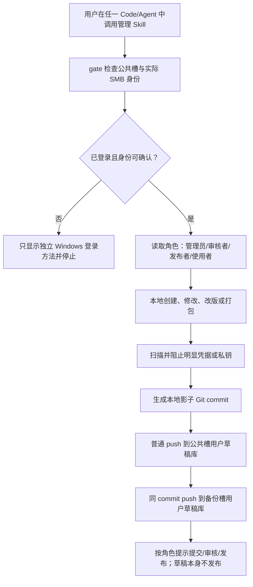
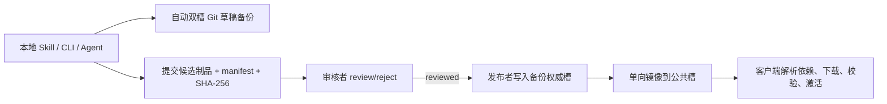
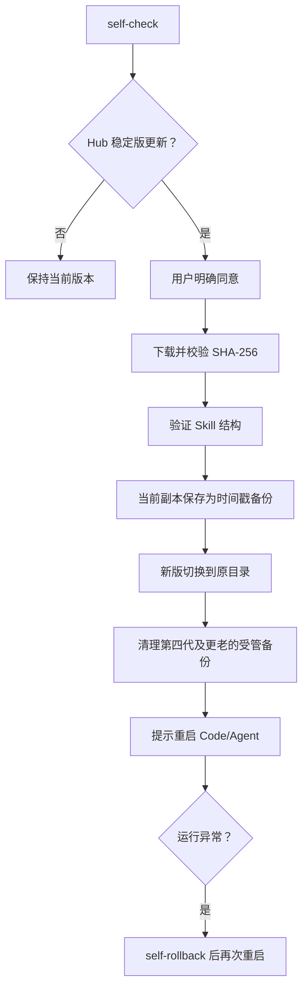
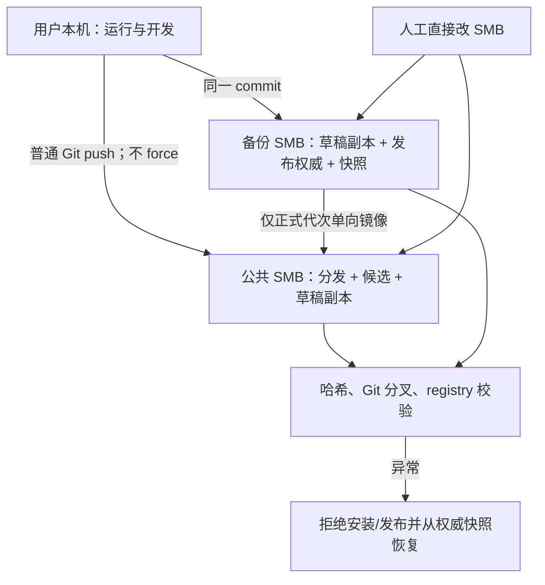

# 流程图谱

## 登录、自动备份和角色提示

```mermaid
flowchart TD
    A["用户在任一 Code/Agent 中调用管理 Skill"] --> B["gate 检查公共槽与实际 SMB 身份"]
    B --> C{"已登录且身份可确认？"}
    C -->|"否"| D["只显示独立 Windows 登录方法并停止"]
    C -->|"是"| E["读取角色：管理员/审核者/发布者/使用者"]
    E --> F["本地创建、修改、改版或打包"]
    F --> G["扫描并阻止明显凭据或私钥"]
    G --> H["生成本地影子 Git commit"]
    H --> I["普通 push 到公共槽用户草稿库"]
    I --> J["同 commit push 到备份槽用户草稿库"]
    J --> K["按角色提示提交/审核/发布；草稿本身不发布"]
```

## 正式发布

```mermaid
flowchart LR
    L["本地 Skill / CLI / Agent"] --> P["自动双槽 Git 草稿备份"]
    L --> S["提交候选制品 + manifest + SHA-256"]
    S --> R["审核者 review/reject"]
    R -->|"reviewed"| U["发布者写入备份权威槽"]
    U --> M["单向镜像到公共槽"]
    M --> C["客户端解析依赖、下载、校验、激活"]
```

## 管理 Skill 自更新

```mermaid
flowchart TD
    A["self-check"] --> B{"Hub 稳定版更新？"}
    B -->|"否"| C["保持当前版本"]
    B -->|"是"| D["用户明确同意"]
    D --> E["下载并校验 SHA-256"]
    E --> F["验证 Skill 结构"]
    F --> G["当前副本保存为时间戳备份"]
    G --> H["新版切换到原目录"]
    H --> I["清理第四代及更老的受管备份"]
    I --> J["提示重启 Code/Agent"]
    J --> K{"运行异常？"}
    K -->|"是"| L["self-rollback 后再次重启"]
```

## 信任边界

```mermaid
flowchart TB
    U["用户本机：运行与开发"] -->|"普通 Git push；不 force"| P["公共 SMB：分发 + 候选 + 草稿副本"]
    U -->|"同一 commit"| B["备份 SMB：草稿副本 + 发布权威 + 快照"]
    B -->|"仅正式代次单向镜像"| P
    X["人工直接改 SMB"] --> P
    X --> B
    P --> V["哈希、Git 分叉、registry 校验"]
    B --> V
    V -->|"异常"| Z["拒绝安装/发布并从权威快照恢复"]
```
