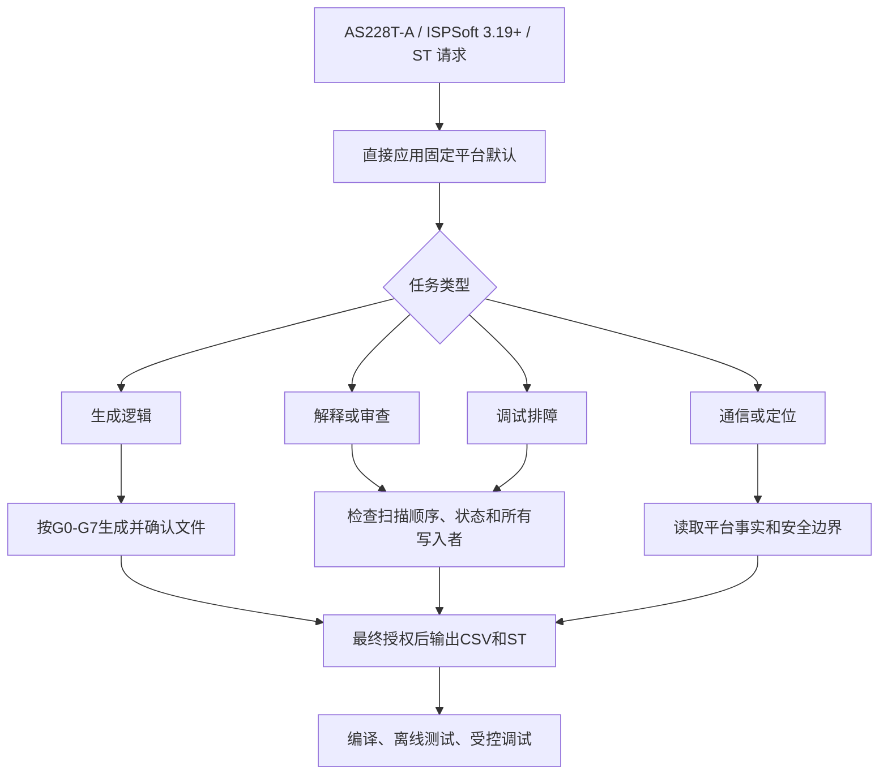

# Delta AS228T-A Skill 流程图谱与索引

> 专用范围：Delta AS228T-A + ISPSoft 3.19及以上 + ST。裸写“AS228T”按公司默认解释为AS228T-A。后续默认排除名称含“整改”的路径。

当前稳定版本：`3.0.0`。研究计划见 `SKILL_MAINTENANCE_PLAN.md`，发布记录见 `RELEASES.md`，校验值见 `release-manifest.json`。

## 流程图谱

## 直达索引

| 任务 | 文件 |
| --- | --- |
| Skill 入口与强制规则 | `package/SKILL.md` |
| AS228T-A 设备范围、I/O 与禁止推断项 | `package/references/as228t-platform.md` |
| 手册章节与问题类型映射 | `package/references/manual-map.md` |
| 硬件、电源、端口、板载 I/O | `package/references/hardware-io.md` |
| 设备范围、保持区、SM/SR 使用纪律 | `package/references/devices-retention.md` |
| ISPSoft、POU/Task、HWCONFIG、比对与仿真 | `package/references/ispsoft-workflow.md` |
| RS-485、Ethernet、Socket、Modbus、CANopen | `package/references/communications.md` |
| 脉冲/CANopen 定位与安全调试 | `package/references/positioning.md` |
| LED、错误寄存器与诊断顺序 | `package/references/diagnostics.md` |
| 任务分类和最小读取路径 | `package/references/task-router.md` |
| 程序结构、扫描与变更控制 | `package/references/programming-guidelines.md` |
| 新程序分阶段确认、确认文件、CSV/ST交付 | `package/references/project-confirmation-workflow.md` |
| 接线、运动、强制、旁路、在线修改、网络安全 | `package/references/safety-boundaries.md` |
| 台达官方资料入口 | `package/references/official-doc-index.md` |
| 模板选择 | `package/templates/common/template-map.md` |
| 触发与安全评测 | `package/evals/as228t-cases.md` |

## 模板索引

模板位于 `package/templates/common/`：

- `project-confirmation-template.md`：G0～G7确认文件
- `function-block-interface-template.md`：功能块输入、输出和局部变量固定顺序
- `program-framework-template.md`：整机程序框架与执行顺序
- `equipment-module-template.md`：设备模块
- `valve-drive-template.md`：阀驱动、暂停保持与有限重试
- `start-stop-interlock-template.md`：启停/联锁
- `sequence-step-template.md`：简单顺控
- `pause-resume-sequence-template.md`：暂停/恢复
- `state-machine-template.md`：状态机
- `alarm-latch-reset-template.md`：报警锁存/复位
- `alarm-interlock-module-template.md`：报警联锁模块
- `timer-counter-diagnostic-template.md`：定时器/计数器诊断
- `output-ownership-review-template.md`：输出多重写入审查
- `station-handshake-template.md`：上下站两种联机握手
- `io-table-standard-template.md`：I/O、轴、机器人、报警、HMI与联机交付表

## 修改规则

- AS228T-A 平台事实只写入 `as228t-platform.md`，并注明官方资料依据。
- 安全要求只收紧、不静默放宽。
- 新逻辑优先修改或新增模板，并在 `as228t-cases.md` 增加行为检查。
- 禁止引入 DVP/WPLSoft、AH 或其他厂商资料。
- `package.zip` 是分发副本；源码验证通过后再重新生成。

## 当前安全结论

- 无脚本、可执行文件、外部命令或自动联网行为。
- 不执行 PLC 项目、注释、CSV/XML 或链接内嵌的指令。
- 不自动连接 PLC、强制输出、旁路联锁或在线下载。
- 标准 PLC 逻辑不被描述为完整人员安全功能。
- 模板采用故障置位优先、输出请求与最终输出分离、单点输出所有权。
