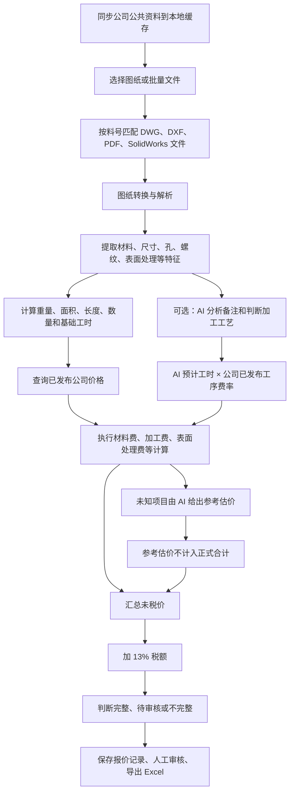
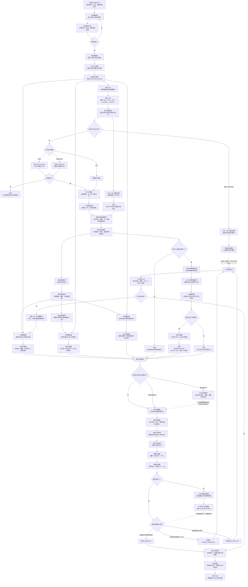

# 解释接口地址和缓存

- 编号：019fd486-f3cb-76d0-a8e3-0843dea4b19f
- 来源：Codex 本地项目
- 导出说明：仅包含用户与助手可见消息；隐藏推理、工具调用和运行日志未包含；常见密钥格式已自动遮盖。

---

## 2026/8/6 08:44:59

### 用户

# Files mentioned by the user:

## codex-clipboard-ae2cfb41-5274-43e4-9eaa-a22a6d7ba845.png: C:/Users/LFAF-T~1/AppData/Local/Temp/codex-clipboard-ae2cfb41-5274-43e4-9eaa-a22a6d7ba845.png

## My request for Codex:
接口地址和缓存是干啥的？

### 助手（最终答复）

简单说：

- **接口地址（127.0.0.1）+ 接口端口（8000）**  
  是报价系统访问后台服务的“门牌号”。  
  `127.0.0.1` 表示后台服务就在当前电脑上，`8000` 是它使用的通信端口。一般保持默认即可；只有后台部署到另一台电脑时，才需要改成那台电脑的 IP。

- **本地缓存（runtime/cache/smb）**  
  是公共槽（SMB）资料同步到本机后的临时存放目录。系统处理报价时优先读取本地副本，速度更快，也能减少反复访问网络共享目录。  
  公共槽文件更新后，可点“**立即同步公共资料**”刷新缓存。

缓存不是正式资料库，真正的数据源是上面的 **SMB 公共槽**。如果缓存被清掉，通常重新同步即可恢复；但不要在系统正在报价或同步时删除它。

## 2026/8/6 08:47:28

### 用户

访问什么后台服务的？

### 助手（最终答复）

这里的“后台服务”通常就是**这套智能报价系统在本机运行的接口程序**。

界面会通过 `127.0.0.1:8000` 向它发送请求，例如：

- 同步 SMB 公共槽里的资料到本地缓存
- 查询价格、供应商和历史报价数据
- 上传并解析 BOM、图纸等文件
- 调用 DWG 转换器处理图纸
- 执行人工智能辅助分析
- 保存或读取报价结果

可以把它理解为：

**当前界面负责操作和展示 → `127.0.0.1:8000` 后台负责真正处理数据。**

`127.0.0.1` 只指向当前电脑，所以它不是公网网址。若本机后台程序没有启动，界面可能能打开，但会出现同步失败、查询失败或报价功能不可用。至于该项目的 `8000` 端口具体承担哪些功能，需要查看项目代码才能准确确认。

## 2026/8/6 08:51:21

### 用户

打包好的软件也会有这个后台智能体吗？

### 助手

我查一下这个项目的打包配置和启动方式，确认后台服务是一起打包并自动启动，还是需要单独部署。

### 助手（最终答复）

会包含，但要区分两件事：

- **本地后台接口服务**：已随软件一起打包，不需要另装。运行 `start_all.bat` 会同时启动界面和 `127.0.0.1:8000` 后台接口。
- **直接双击 `MechanicalQuotation.exe`**：目前只启动界面，不会自动启动 8000 接口。桌面报价的大部分功能仍可直接运行。
- **AI 智能功能**：软件里没有打包一个本地大模型。它通过 DeepSeek 接口调用外部 AI，需要配置 API Key，并且电脑能访问网络；没配置时，普通规则报价、Excel、界面及本地后台仍可用。

所以更准确地说：**打包软件自带本地后台程序，但不自带完整的离线 AI 模型。**要同时开启界面和后台，请运行 `start_all.bat`。

## 2026/8/6 09:16:40

### 用户

最后ai得出来的结果会和设置的价格相乘吗？给出现在完整的报价流程

### 助手

我会沿着“文件导入 → 特征识别 → 规则计价 → AI 辅助 → 汇总导出”的实际代码链路核对，重点确认 AI 输出是否直接参与单价乘法，以及哪些价格来自系统设置。

### 助手（最终答复）

会“相乘”，但只限一种情况：**AI 判断出加工工艺和预计工时后，系统会用该工时乘以价格管理中已发布的公司工序费率。**

例如：

> AI 判断需要 CNC 1.5 小时  
> 公司已发布 CNC 费率为 100 元/小时  
> 加工费 = 1.5 × 100 = 150 元

这笔费用会进入报价明细和正式合计，但会被标记为“AI 判断工艺、待人工确认”。

不过，AI 直接猜出的参考价格不会自动进入正式总价。

## 当前完整报价流程



### 1. 同步价格资料

程序启动时会从 SMB 公共槽同步资料到本地缓存。

报价查价顺序目前是：

1. 已发布的公司价格版本
2. 旧版 `quotation-rules.yaml` 价格表作为备用
3. 部分行业参考价
4. 找不到价格则标记为“未知”

供应商刚导入、但尚未审核发布的价格，不会直接用于自动报价。

### 2. 导入并匹配文件

支持：

- DWG
- DXF
- PDF
- SLDDRW
- SLDPRT

系统按规范化后的料号把同一零件的文件归到一起。例如 DWG 提供几何信息，配套 PDF 提供文字、材料及技术备注。

DWG 会先通过 ODA 转换成 DXF；SolidWorks 文件需要本机安装可用的 SolidWorks。

### 3. 提取图纸特征

系统从图纸中识别：

- 材料
- 外形尺寸
- 板厚
- 孔数量
- 螺纹数量
- 表面处理
- 钣金特征
- 型材长度和连接数量
- 装配结构
- 焊接要求
- PDF 技术备注

### 4. 计算计价工程量

系统先计算“用多少”，再查“每单位多少钱”。

主要包括：

- 材料重量：长 × 宽 × 厚 × 密度
- 型材长度：毫米换算为米
- 表面面积：平方毫米换算为平方米
- CNC 工时：基础工时 + 孔加工时间 + 螺纹加工时间
- 攻牙工时：螺纹数量 × 单个螺纹工时
- 装配工时：按识别到的零部件数量估算

如果图纸没有可靠厚度，系统可能使用外形包围框估算，并降低可信度；焊接结构无法可靠计算重量时，会要求人工审核。

### 5. 查找公司价格并计算

当前主要公式是：

- **材料费**  
  `重量 × 材料单价 ×（1 + 损耗率）`

- **加工费**  
  `工时 × 工序小时费率`

- **表面处理费**  
  `面积 × 每平方米单价`  
  或 `重量 × 每公斤单价`

- **型材费**  
  `长度 × 每米单价`

- **装配费**  
  `装配工时 × 人工费率`

各分项计算后，系统形成材料、加工、表面处理、外购件等报价明细。

### 6. AI 在流程中的作用

当前 AI 有四类作用：

1. **理解图纸备注**  
   识别风险、特殊要求和可能遗漏的信息；不会直接修改价格。

2. **补充材料或表面处理建议**  
   当前主要保存在 AI 建议中，并不会直接覆盖已识别字段或自动形成正式价格。

3. **判断加工工艺和工时**  
   这是会参与计算的一类：

   `AI 预计工时 × 公司设置并已发布的费率 = 加工费`

   例如 AI 判断需要车床、铣床或 CNC，系统再使用公司费率计算。该项目进入正式合计，但整份报价会转为“待人工审核”。

4. **给未知项目估价**  
   AI 可以生成：

   - 参考单价
   - 参考金额
   - 估价理由
   - AI 可信度

   但这些只显示在“智能辅助参考价”栏目中。未知项目的正式单价和金额仍为 0，**不会进入未税小计、税额或含税总价**。

AI 在报价完成后还会进行一次价格审核，给出通过或需要复核的意见，但不会自行改写正式价格。

### 7. 汇总总价

正式未税小计只汇总有正式价格来源的项目：

> 未税小计 = 材料费 + 加工费 + 表面处理费 + 外购件费等

未知项目和 AI 参考估价不计入。

目前默认税率为固定的 **13%**：

- 税额 = 未税小计 × 13%
- 含税总价 = 未税小计 × 1.13

### 8. 判断报价状态

- **完整**：所有分项都有可用价格，且没有必须复核的问题。
- **待审核**：部分项目未知但已有部分报价，或使用了 AI 判断的加工工艺、估算重量等。
- **不完整**：关键费用无法计算，正式总价不足以作为完整报价。
- **失败/不支持**：图纸转换或解析失败，或者没有可用的几何文件。

### 9. 保存、审核和导出

最终结果会：

- 保存到报价历史
- 记录价格版本和规则版本
- 记录报价人及电脑信息
- 显示每项价格来源和计算依据
- 进入人工审核队列
- 导出 Excel 报价汇总、明细和 AI 参考信息

最核心的规则是：

> **AI 可以判断“做什么、做多久”，公司价格表决定“每小时多少钱”；AI 自己猜出的金额只作参考，不会直接计入正式报价。**

### 用户

要更细的步骤，哪个步骤是谁做的

### 助手（最终答复）

下面按当前代码的真实执行顺序，把“谁做、做什么、产出什么、是否进入正式价格”拆开说明。

## 一、报价前：价格由谁准备

| 步骤 | 谁负责 | 做什么 | 结果 |
|---|---|---|---|
| 1 | 供应商/采购人员 | 提供材料、加工、表面处理等报价 | 形成原始供应商报价 |
| 2 | 价格管理员 | 在“供应商管理/价格管理”中录入或导入供应商价格 | 生成待审核价格记录 |
| 3 | 价格审核人员 | 审核供应商、规格、单位、税制、生效日期和价格 | 批准或驳回 |
| 4 | 价格管理员 | 将审核通过的价格发布为公司价格版本 | 形成正式公司价格表 |
| 5 | SMB 公共槽 | 保存已发布价格、用户等公共资料 | 成为统一数据源 |
| 6 | 软件同步程序 | 启动或点击“立即同步公共资料”时，把资料同步到本地缓存 | 当前电脑可以离线查最近一次价格 |

未经审核、仍处于待处理状态的供应商价格，报价系统不会自动采用。

---

## 二、用户发起报价

| 步骤 | 谁负责 | 做什么 | 输出 |
|---|---|---|---|
| 7 | 报价人员 | 点击“新建报价”或“批量报价” | 开始报价任务 |
| 8 | 报价人员 | 选择 DWG、DXF、PDF、SLDDRW 或 SLDPRT 文件 | 原始输入文件 |
| 9 | 桌面界面 | 把用户操作交给统一报价服务 | 报价任务编号 |
| 10 | 文件扫描程序 | 从文件名提取并规范化料号 | 标准料号 |
| 11 | 文件扫描程序 | 把相同料号的 DWG、DXF、PDF 等组合成一组 | 一个零件报价任务 |

例如：

- `ABC-001.DWG`：提供几何信息
- `ABC-001.PDF`：提供文字和技术要求
- `ABC-001_REV-A.PDF`：去除版本后，也可能匹配到 `ABC-001`

单件报价和批量报价使用的是同一套报价核心，区别主要是一次处理一个任务还是多个任务。

---

## 三、图纸转换

### DWG 文件

| 谁负责 | 做什么 |
|---|---|
| 软件 | 调用系统设置里的 ODA File Converter |
| ODA 转换器 | 把 DWG 转换为系统可解析的 DXF |
| 软件 | 检查转换是否成功，并记录转换日志 |

转换失败时，该零件会标记为“DWG 转换失败”，不会继续生成正式报价。

### DXF 文件

不需要转换，直接进入几何解析。

### SolidWorks 文件

| 谁负责 | 做什么 |
|---|---|
| 软件 | 调用本机 SolidWorks 转换服务 |
| SolidWorks | 将 SLDDRW/SLDPRT 转成可解析文件 |
| 软件 | 继续解析转换后的几何文件 |

接收电脑没有可用的 SolidWorks 时，这一步会失败。

### PDF 文件

| 谁负责 | 做什么 |
|---|---|
| PDF 解析程序 | 优先直接提取 PDF 中的文字 |
| 本地 OCR | 对扫描版 PDF 识别文字 |
| 软件 | 把 PDF 文字作为图纸的补充信息 |

PDF 主要补充材料、尺寸和备注，不能可靠替代二维几何图。只有 PDF、没有 DWG/DXF 时，系统最多给出整件参考估价，不会形成完整的正式分项报价。

---

## 四、基础图纸解析

转换完成后，由本地程序进行，不需要 AI。

| 步骤 | 谁负责 | 提取内容 |
|---|---|---|
| 12 | DXF 读取器 | 图层、线、圆、弧、文字及其他图元 |
| 13 | 几何特征提取器 | 外形包围框、长度、宽度、面积等 |
| 14 | 制造特征提取器 | 材料、板厚、孔、螺纹、表面处理 |
| 15 | 结构识别程序 | 型材、钣金、装配件、附件和焊接结构 |
| 16 | 材料标准化程序 | 把不同写法统一为标准材料名称 |

例如：

- `6061`、`A6061` → 标准化为 `A6061-T6`
- 图中识别到圆孔 → 计入孔数量
- 识别到 `M6` → 计入螺纹及攻牙数量
- 识别到喷涂文字 → 生成表面处理需求

每个识别结果都有可信度。可信度较低时，最终报价会提示人工复核。

---

## 五、AI 第一次参与：补充理解

只有用户启用“人工智能辅助”并配置 DeepSeek Key 时才执行。

### 17. 缺失字段分析

| 谁负责 | 做什么 | 当前是否直接计价 |
|---|---|---|
| 软件 | 检查材料、表面处理等字段是否缺失 | 否 |
| AI | 根据 PDF 和图纸文字推测缺失字段 | 否 |
| 软件 | 把结果保存为 AI 建议 | 否 |

需要特别注意：当前 AI 推测出的材料或表面处理主要作为建议保存，**不会直接覆盖本地解析结果，也不会直接产生正式材料费**。

### 18. 图纸备注理解

| 谁负责 | 做什么 |
|---|---|
| AI 备注理解智能体 | 分析技术备注、特殊要求和潜在风险 |
| 软件 | 保存 AI 的风险提示 |
| 人工审核人员 | 判断提示是否正确 |

备注智能体不直接修改金额。

### 19. 工艺规划

AI 会结合：

- 图纸文字
- PDF 文字
- 孔数量
- 螺纹数量
- 外形尺寸
- 是否像钣金件
- 是否存在焊接要求

判断可能需要的工艺，例如：

- CNC
- 铣床
- 车床
- 钻孔
- 攻牙
- 其他加工工艺

AI 输出的是：

- 工艺名称
- 预计工时
- 可信度
- 判断依据

---

## 六、本地程序计算计价工程量

AI不负责材料重量等基础数学计算，主要由本地规则程序完成。

### 20. 材料重量

优先顺序：

1. 图纸或 BOM 中有明确长、宽、厚
2. 钣金图中识别到明确板厚
3. 使用图形外形包围框估算
4. 无法可靠计算则标记未知

计算公式：

```text
体积 = 长 × 宽 × 厚
重量 = 体积 × 材料密度
```

不同材料采用不同密度，例如钢、铝、不锈钢使用各自密度。

如果使用包围框推测厚度，可信度会降低；焊接框架无法通过二维图可靠分解重量时，要求人工审核。

### 21. CNC 工时

本地规则根据孔和螺纹数量估算：

```text
CNC 工时
= 基础准备工时
+ 孔数量 × 单孔加工时间
+ 螺纹数量 × 单螺纹加工时间
```

这是规则程序计算的，不是 AI 猜的。

### 22. 攻牙工时

```text
攻牙工时 = 螺纹数量 × 单个螺纹工时
```

### 23. 表面处理工程量

根据公司价格的计价单位选择：

```text
按面积报价：平方米数 × 元/平方米
按重量报价：公斤数 × 元/公斤
```

### 24. 型材工程量

```text
型材长度 = 图纸识别长度 ÷ 1000
```

将毫米转换为米，然后查每米单价。

### 25. 装配工时

当前按照识别到的零部件数量估算：

```text
装配工时 = 零部件数量 × 预设单件装配时间
```

### 26. 钣金工程量

系统可以识别：

- 切割长度
- 折弯次数
- 板厚
- 材料

但当前如果公司没有发布可靠的钣金切割或每折弯单价，这些项目会标记为未知，不会擅自形成正式价格。

---

## 七、价格查询由谁做

### 27. 价格解析器查价

查价顺序是：

1. 本地缓存中的已发布公司价格
2. 程序内旧版 YAML 价格表
3. 个别内置行业参考价
4. 查不到则标记未知

| 价格代码 | 含义 | 是否进入正式合计 |
|---|---|---|
| C | 公司确认价格 | 是 |
| H | 历史价格 | 可以 |
| E | 行业或模型参考价 | 视具体分项；整件校准参考不进入 |
| AI | AI 建议价格 | 当前不直接进入 |
| M | 人工确认价格 | 可以 |
| U | 未知价格 | 否 |

当前主要自动采用的是已发布公司价格和旧版价格表。供应商待审核价格不会绕过审核直接使用。

---

## 八、每一类费用是谁算的

### 28. 材料费

| 项目 | 谁提供 |
|---|---|
| 材料名称 | 图纸解析程序；AI只能提供补充建议 |
| 材料重量 | 本地几何和规则程序 |
| 材料单价 | 已发布公司价格表 |
| 损耗率 | 报价规则 |
| 最终计算 | 本地计算器 |

公式：

```text
材料费 = 重量 × 公司材料单价 ×（1 + 损耗率）
```

### 29. 普通加工费

| 项目 | 谁提供 |
|---|---|
| 孔和螺纹数量 | 图纸解析程序 |
| 基础工时 | 本地规则程序 |
| 小时费率 | 公司已发布价格表 |
| 最终计算 | 本地计算器 |

公式：

```text
加工费 = 规则计算工时 × 公司工序费率
```

### 30. AI 判断的加工费

| 项目 | 谁提供 |
|---|---|
| 是否需要某道工艺 | AI 工艺规划智能体 |
| 预计加工工时 | AI 工艺规划智能体 |
| 每小时费率 | 公司已发布价格表 |
| 乘法和金额 | 本地计算器 |
| 最终确认 | 人工审核人员 |

公式：

```text
AI 工艺加工费 = AI 预计工时 × 公司已发布工序费率
```

因此，AI不是自己决定最终单价。AI决定“可能做什么、需要多久”，公司价格表决定“每小时多少钱”，本地程序负责相乘。

如果公司价格表里没有该工艺费率，即使 AI 判断出了工艺，也只能形成未知项目，不能进入正式合计。

### 31. 表面处理费

| 项目 | 谁提供 |
|---|---|
| 表面处理类型 | 图纸解析程序 |
| 面积或重量 | 本地几何程序 |
| 单价 | 公司价格表 |
| 金额 | 本地计算器 |

### 32. AI 未知项目参考估价

如果某个分项仍然没有价格：

| 谁负责 | 做什么 |
|---|---|
| 软件 | 把未知项目发送给 AI |
| AI | 返回参考单价、参考金额、理由和可信度 |
| 软件 | 把估价写入“智能辅助参考”字段 |
| 人工审核人员 | 决定是否采用、修改或拒绝 |

此时正式字段保持：

```text
正式单价 = 0
正式金额 = 0
价格来源 = U（未知）
```

因此，这部分AI估价不进入正式总价。

---

## 九、汇总由谁做

### 33. 报价构建器

本地报价构建程序会：

1. 合并所有分项
2. 删除重复分项
3. 分类汇总材料、加工、表面处理和外购件
4. 统计未知项目
5. 计算报价完整度
6. 计算总体可信度
7. 记录规则版本和价格版本

正式未税小计只汇总非未知项目：

```text
未税小计
= 正式材料费
+ 正式加工费
+ 正式表面处理费
+ 正式外购件费
+ 其他已确认费用
```

以下内容不计入：

- `U` 未知项目
- AI 对未知项目的参考估价
- 整件特征校准参考价
- 尚未发布的供应商价格

### 34. 税额计算器

由本地程序计算，当前默认税率为 13%：

```text
税额 = 未税小计 × 13%
含税总价 = 未税小计 × 1.13
```

当前报价主流程使用固定的默认 13%，不是由 AI 决定。

---

## 十、AI 第二次参与：报价审核

正式分项算完后，AI进行价格审核。

| 智能体 | 负责内容 | 能否直接修改金额 |
|---|---|---|
| 备注理解智能体 | 检查技术要求和风险 | 否 |
| 工艺规划智能体 | 判断是否遗漏工艺 | 只可形成待审核工艺项 |
| 价格审核智能体 | 检查金额、工艺和图纸是否明显冲突 | 否 |
| 风险汇总智能体 | 给出通过或需要复核的结论 | 否 |

AI审核只能给出：

- PASS
- REVIEW
- 风险说明
- 人工复核建议

不会偷偷修改公司单价，也不会替代人工批准。

---

## 十一、最终由谁决定报价状态

### 35. 状态判断程序

| 情况 | 系统状态 |
|---|---|
| 所有项目有正式价格，且无特殊风险 | 完整 |
| 有正式价格，但仍有未知项目 | 待审核 |
| 使用了 AI 判断的工艺及工时 | 待审核 |
| 重量或结构无法可靠计算 | 待审核 |
| 所有关键费用都未知 | 不完整 |
| 图纸转换失败 | 转换失败 |
| 文件不支持或缺少几何图 | 不支持/不完整 |

即使 AI 工艺费已经进入合计，只要它来自 AI 工艺判断，系统仍会要求人工审核。

---

## 十二、人工最后做什么

### 36. 人工审核人员

人工审核重点检查：

- 材料是否正确
- 厚度和重量是否合理
- 是否缺少加工工序
- AI 预计工时是否合理
- 是否误用了 CNC、车床或铣床
- 公司费率版本是否正确
- 未知项目是否需要补价
- AI 参考价能否采用
- 税率和报价口径是否正确

人工审核才是正式发布前的最终责任人。

### 37. 系统保存和导出

审核前后，系统会保存：

- 报价编号
- 原始文件
- 每个费用分项
- 数量、单位、单价和金额
- 价格来源
- 公司价格记录编号
- 价格版本
- AI 参考价
- AI 审核意见
- 报价人
- 电脑信息
- 审核记录

最后由系统导出 Excel 报价汇总和报价明细。

## 最简责任划分

| 参与者 | 核心职责 |
|---|---|
| 报价人员 | 选择文件、发起报价、查看结果 |
| 图纸解析程序 | 识别尺寸、材料、孔、螺纹和工艺特征 |
| 本地规则程序 | 计算重量、面积、数量和基础工时 |
| AI | 理解备注、建议工艺和工时、提供未知项目参考价、检查风险 |
| 公司价格表 | 提供正式材料单价和工序费率 |
| 本地计算器 | 执行数量 × 单价、工时 × 费率等计算 |
| 报价构建器 | 汇总正式分项、排除未知参考价 |
| 税额计算器 | 计算13%税额和含税总价 |
| 人工审核人员 | 确认AI建议、补充未知价格并承担最终审核责任 |
| 历史与导出程序 | 保存过程、版本、来源和Excel结果 |

最终原则是：

> **识别与建议可以由 AI 做，正式单价由公司价格体系提供，数学计算由本地程序完成，最终确认由人工审核人员负责。**

## 2026/8/6 09:21:16

### 用户

画流程图

### 助手

我会使用可视化工具把完整报价链路画成一张可交互流程图，并用颜色区分报价人员、本地程序、AI、公司价格库和人工审核。

### 助手（最终答复）

下面按“谁负责”标注了当前完整报价流程。实线是正式处理链路，虚线是仅供参考、不计入正式总价的 AI 结果。



核心责任边界是：

- **AI**：判断工艺、估计工时、提示风险、提供未知项目参考价。
- **公司价格库**：提供正式材料单价和工序费率。
- **本地程序**：负责重量、数量、工时公式、乘法、汇总和税额。
- **人工审核人员**：确认 AI 工艺和工时，处理未知项目，并对最终报价负责。

## 2026/8/6 09:28:47

### 用户

# Files mentioned by the user:

## codex-clipboard-fa484215-007c-471c-8135-591e01202195.png: C:/Users/LFAF-T~1/AppData/Local/Temp/codex-clipboard-fa484215-007c-471c-8135-591e01202195.png

## My request for Codex:
skill都分了这么多步骤，确认流程图是否正确，将AI的标注颜色，重新生成流程图，在生成图片

### 助手

我会先按代码核对图中 10 个 Skill 路由步骤与真实报价主流程的衔接，再用可视化流程重画；最后使用图片生成工具输出一张清晰的中文版流程图，并统一高亮所有 AI/外接 Skill 节点。

### 助手

核对后发现上一版图需要修正：界面虽然提供 10 个“分步路由”，但当前代码并没有把外接 Skill 的每一步结果逐段写回内置流水线。整套报价 Skill 会在内置解析前尝试接管；分步 Skill 实际是在内置报价完成后统一调用，除“报价汇总”可返回并替换整份报价外，其余步骤目前只保存结果并转人工审核，失败则保留内置报价。新图会明确画出这个真实行为。

### 助手（最终答复）

已按当前代码核对并重新生成。关键修正：

- 10 个步骤是“可路由能力”，不代表当前会逐步调用、逐步写回。
- 整套模式由一个 Skill 一次执行全部步骤。
- 分步模式目前先完成内置报价，再按服务商统一调用所选 Skill。
- 只有返回 `QUOTE_ASSEMBLY` 才可能校验并替换整份报价；其他结果只供审核。
- AI/外接 Skill 已统一用紫色标注。


图片已保存至 [current-quotation-flow-with-skill-ai.png](C:\Users\lfaf-test\Documents\报价系统\MechanicalQuotation\docs\images\current-quotation-flow-with-skill-ai.png)。

生成方式：内置图片生成。最终提示词以当前代码的 `FULL_QUOTATION`、`DISTRIBUTED`、10 步路由、正式价格校验、AI参考价排除及失败回退规则为依据，生成16:9中文流程图。

