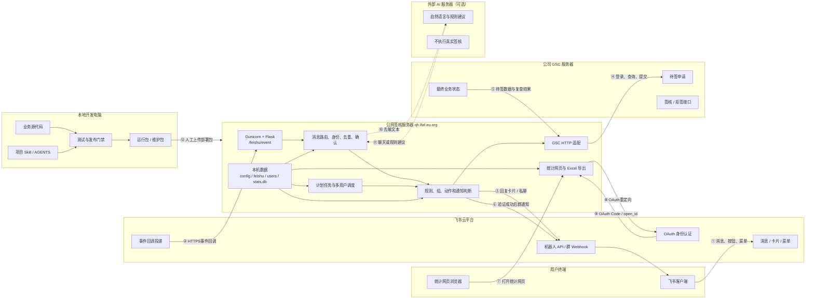

# 飞书签核系统——执行主体与信息流

当前版本：`2026.07.28.1400`

这里的“执行主体”表示代码或平台能力实际运行在哪里。系统分为六个执行主体：

1. 用户终端；
2. 飞书云平台；
3. 公网签核服务器；
4. 公司 GSC 服务器；
5. 外部 AI 服务器；
6. 本地开发电脑。

## 1. 执行主体框架



## 2. 各主体实际执行什么

| 执行主体 | 实际执行内容 | 主要保存的数据 |
|---|---|---|
| 用户终端 | 用户输入、点击卡片、确认动作、浏览个人统计 | 飞书客户端本地会话；不保存服务器规则库 |
| 飞书云平台 | 接收消息、投递事件、OAuth认证、发送机器人卡片和群Webhook | 飞书消息、事件、`open_id`、OAuth状态 |
| 公网签核服务器 | 运行全部Python业务代码、规则判断、定时任务、GSC连接、统计网页 | 全局配置、个人账号、规则、组、设置、统计 |
| 公司GSC服务器 | 提供待签申请、执行真实签核/拒签、保存最终状态 | 公司业务申请和签核结果 |
| 外部AI服务器 | 处理自然语言聊天和规则解析建议 | API请求期间的文本；不应收到密码、Token或完整配置 |
| 本地开发电脑 | 修改代码与Skill、运行测试、生成发布包 | 源代码、Skill、测试和压缩包 |

## 3. 关键信息流

| 编号 | 来源 → 目标 | 内容 | 协议/方式 |
|---|---|---|---|
| ① | 用户 → 飞书 | 私聊文字、群@、卡片按钮、菜单事件 | 飞书客户端 |
| ② | 飞书 → 公网服务器 | 消息事件、卡片表单、菜单事件、`open_id` | HTTPS `/feishu/event` |
| ③ | 公网服务器 → 飞书 → 用户 | 查询结果、帮助、规则卡、设置卡、确认提示 | 飞书机器人API |
| ④ | 公网服务器 → 公司GSC | 用户账号登录、待签查询、签核或拒签提交 | HTTPS/HTTP会话 |
| ⑤ | 公司GSC → 公网服务器 | 待签申请、提交响应、重新查询后的最终状态 | HTTP响应 |
| ⑥ | 公网服务器 → 飞书群 | 复查成功后的签核或拒签通知 | 群Webhook |
| ⑦—⑨ | 浏览器、公网服务器、飞书 | OAuth登录、Code、当前用户`open_id` | HTTPS OAuth |
| ⑩—⑪ | 公网服务器 ↔ AI服务器 | 自然语言、规则解析请求及建议结果 | OpenAI兼容HTTPS API |
| ⑫ | 本地电脑 → 公网服务器 | 通过门禁验证的服务器运行包 | 人工上传/宝塔 |

## 4. 敏感信息实际经过哪里

### 签核平台账号密码

当前用户通过飞书私聊输入账号密码，因此传输路径是：

```text
用户飞书客户端
→ 飞书云平台
→ 公网签核服务器 /feishu/event
→ users/<open_id>/auth.json
→ 登录公司GSC服务器
```

要求：

- 只能私聊机器人提交，不能在群里发送；
- 公网服务器日志不得输出账号密码；
- `auth.json` 不进入运行包或维护包；
- AI请求不得携带账号密码；
- GSC连接应优先启用有效的 HTTPS 证书验证。

### 飞书 App Secret、AI Key 和 OAuth Secret

仅保存在公网服务器 `feishu.json`，用于服务端调用飞书或AI接口。它们不应发送给飞书用户、不进入统计数据库、不进入发布包。

### 个人规则和统计

规则、组和设置保存在公网服务器的 `users/<open_id>/`；统计保存在 `data/stats.db`。飞书只负责展示服务器返回的卡片，不是规则和统计的权威存储。

### 公司签核数据

申请单和最终签核状态的权威来源是公司 GSC 服务器。公网服务器只抓取当前待签数据并保存必要审计字段，不能用本地提交响应替代GSC最终状态。

## 5. 三个重要边界

```text
飞书边界：
负责身份和消息传输，不执行签核规则。

公网服务器边界：
执行机器人、规则、自动任务和统计，但真实业务结果必须由GSC复查。

公司服务器边界：
保存真实申请与签核结果，是最终业务状态权威来源。
```

外部AI和项目Skill都不属于真实签核执行主体：

- AI服务器只能返回聊天或规则建议；
- Skill只在本地开发或服务器AI维护环境中指导修改、测试和发布；
- 真正的签核提交只能由公网服务器中的确定性业务代码调用GSC。
