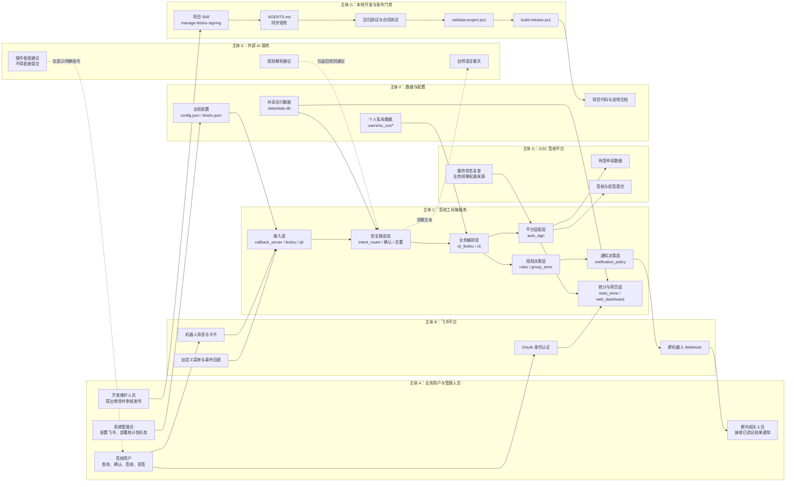
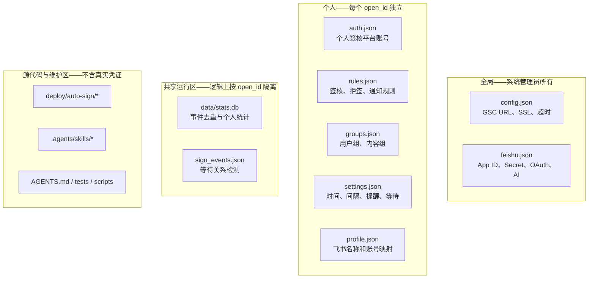
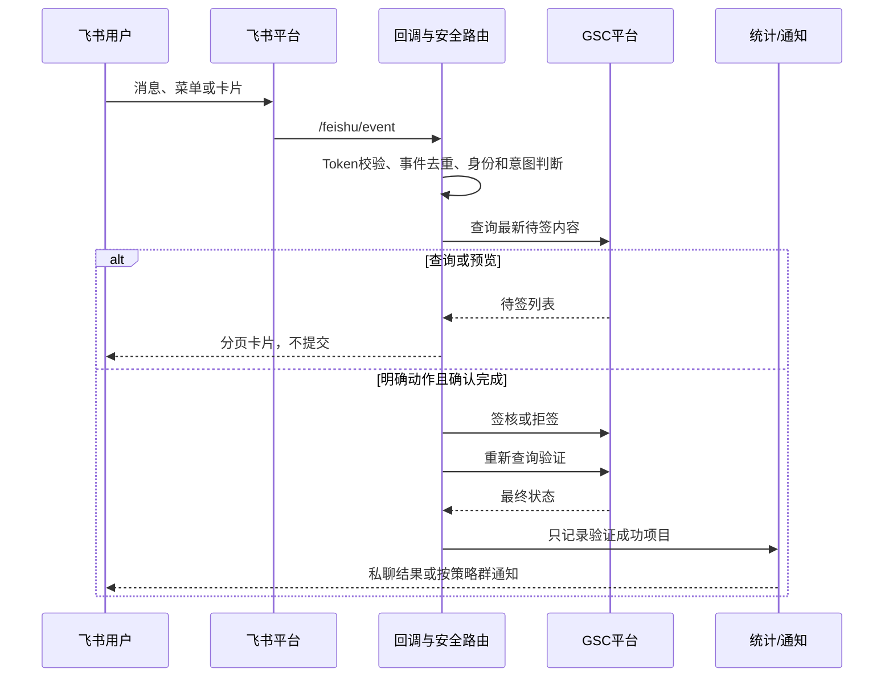
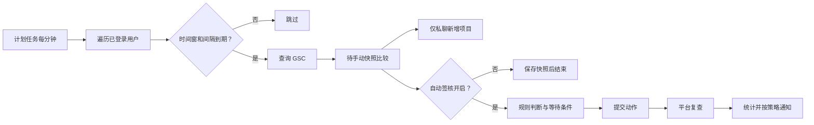
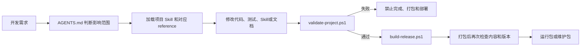

# 签核工具箱系统架构——按主体分区

当前运行版本：`2026.07.28.1400`

本架构不只按代码文件划分，而是先区分“谁在使用、谁提供能力、谁保存数据、谁负责维护”，再说明各主体之间允许发生的数据流。

如果需要飞书签核系统本身的分层技术框架图，请查看同目录
`飞书签核系统框架说明.md` 和 `飞书签核系统框架图.svg`。

如果需要按执行位置查看飞书云、公网签核服务器、公司GSC服务器、外部AI和本地开发电脑之间的信息流，
请查看 `执行主体与信息流说明.md` 和 `飞书签核系统_执行主体框架图.svg`。

## 1. 主体总览



## 2. 各主体的责任边界

| 主体 | 主要责任 | 拥有或处理的数据 | 不负责的事情 |
|---|---|---|---|
| 业务用户 | 登录、查询、维护个人规则和设置、确认人工动作 | 本人的飞书身份、签核账号、规则、组、设置 | 不能查看其他用户统计；不能让 AI 自行代签 |
| 群内相关人员 | 查看已经验证成功的签核或拒签结果 | 群通知卡片 | 不参与个人凭证和规则管理 |
| 系统管理员 | 配置飞书应用、OAuth、域名、Gunicorn、计划任务 | 全局配置和部署环境 | 不替用户决定签核规则 |
| 飞书平台 | 传递消息、菜单、卡片、OAuth 身份和群通知 | `open_id`、事件、卡片回调、OAuth Code | 不判断业务规则，不保存签核平台密码 |
| 签核工具箱服务 | 身份隔离、安全路由、规则判断、执行编排、统计和通知 | 待签数据、规则结果、确认快照、验证结果 | 不能把 AI 输出直接当成签核动作 |
| GSC 签核平台 | 提供待签数据、接受动作、返回最终业务状态 | 申请单、签核与拒签状态 | 不管理飞书消息、个人通知策略 |
| 外部 AI 服务 | 自然聊天、解释、生成规则建议、提示明确指令 | 去敏后的用户文本和必要上下文 | 不直接执行签核、拒签、全签或全拒 |
| 数据与配置 | 保存全局连接配置、个人数据和统计审计 | JSON、SQLite、运行状态 | 不包含业务处理逻辑 |
| 本地开发门禁 | 指导 AI 维护、验证代码与 Skill 同步、阻止错误发布 | 源代码、Skill、测试和发布包 | 不参与服务器运行时签核 |

## 3. 签核工具箱服务内部区域

### 3.1 接入区

| 模块 | 职责 |
|---|---|
| `qh.py` | 统一 CLI 入口 |
| `callback_server.py` | 飞书消息、卡片、菜单、OAuth 路由和健康检查 |
| `feishu.py` | 飞书 Token、消息和卡片发送 |

接入区只负责接收、校验和回复，不应直接包含平台提交细节。

### 3.2 安全与编排区

| 模块 | 职责 |
|---|---|
| `intent_router.py` | 区分预览、查询、解释、规则和潜在动作 |
| `callback_server.py` | 事件去重、权限检查、二次确认和命令分发 |
| `cli_feishu.py` | 多用户定时执行、时间窗口、间隔、等待和增量提醒 |
| `cli.py` | 确定性的签核平台 CLI 操作 |

这里是高风险边界：AI建议必须在进入动作层前转换为用户可复制的明确指令，不能直接调用提交函数。

### 3.3 规则与通知区

| 模块 | 职责 |
|---|---|
| `rules.py` | 签核、拒签和待手动分类 |
| `group_store.py` | 用户组、内容组、旧名单兼容和改名引用更新 |
| `notification_policy.py` | 独立决定是否发送群通知 |

动作判断与通知判断相互独立。通知优先级固定为：

```text
人工明确发群/不发群
> 独立通知规则
> 动作规则 group_notify
> 用户默认值（默认不发群）
```

### 3.4 平台适配区

| 模块 | 职责 |
|---|---|
| `auto_sign.py` | HTTP 登录、抓取待签页面、解析、签核、拒签和重新查询验证 |

GSC 平台是最终业务状态的权威来源。提交响应不能单独作为成功依据，必须重新查询确认项目已经离开待签列表。

### 3.5 数据与展示区

| 模块 | 职责 |
|---|---|
| `user_manager.py` | 创建和管理每个 `open_id` 的个人目录 |
| `stats_store.py` | 事件去重、平台验证成功记录、个人统计查询 |
| `web_dashboard.py` | OAuth 个人网页、统计筛选、Excel 导出、个人规则、用户组/内容组与设置编辑 |

网页不能相信 URL 中传入的 `open_id`，必须使用飞书 OAuth 得到的当前身份在服务端过滤统计并读写规则、组与设置；修改请求必须校验 CSRF。

## 4. 数据所有权分区



数据隔离原则：

- 新用户只创建自己的空规则、空组和默认设置；
- 用户目录不能被发布包覆盖；
- `stats.db` 虽为共享数据库，查询和导出必须强制带当前 `open_id`；
- `auth.json`、`feishu.json`、真实 `config.json`、用户数据、日志和历史 Excel 不进入发布包；
- 旧 `sign_records.xlsx` 没有可靠 `open_id`，不能自动导入个人统计。

## 5. 三条独立运行链路

### 5.1 用户交互链路



### 5.2 定时自动链路



待手动提醒和自动签核是两个独立开关。自动签核关闭时，提醒链路只能查询、比较和私聊，不能执行等待、签核或拒签。

### 5.3 本地开发与发布链路



Skill 属于本地开发维护主体，不在飞书消息到 GSC 的服务器运行链路中。只有服务器本身运行兼容 Agent 并加载维护包时，Skill 才在服务器上参与开发维护。

## 6. 部署分区

```text
服务器运行区
├─ Gunicorn :7000
│  └─ callback_server.py      飞书回调与统计网页
├─ 宝塔/系统计划任务
│  └─ qh.py feishu send      每分钟触发用户调度
├─ auto-sign/                业务程序
├─ users/                    个人数据
├─ data/                     统计与去重
├─ config.json               GSC 全局配置
└─ feishu.json               飞书、OAuth、AI 全局配置

本地开发维护区
├─ .agents/skills/           项目 Skill
├─ AGENTS.md                 代码与 Skill 同步矩阵
├─ tests/                    回归与合同测试
├─ scripts/                  统一验证工具
└─ build-release.ps1         验证通过后才允许打包
```

默认运行包不包含本地维护区。使用 `-IncludeSkill` 生成的维护包才会加入 Skill、AGENTS 和门禁脚本。

## 7. 核心信任边界

| 边界 | 信任原则 |
|---|---|
| 飞书事件 → 回调服务 | 校验回调 Token，并按事件 ID 去重 |
| 飞书用户 → 个人数据 | 使用事件中的 `open_id`，不得由用户自由指定 |
| OAuth 网页 → 统计数据库 | 服务端使用 OAuth `open_id` 强制过滤 |
| AI输出 → 动作执行 | AI输出不可信，只能聊天、解析规则或提示明确指令 |
| 服务 → GSC | 提交后必须重新查询，以GSC最终状态为准 |
| 动作成功 → 群通知 | 平台复查成功后才能发送 |
| 源代码 → 发布包 | 必须通过统一验证、合同测试和敏感文件检查 |
# 安全存储与灾备边界

`secure_store.py` 只负责主密钥解析、用户凭证/系统密钥的认证加密和安全配置叠加；
主密钥不得进入项目目录。`security_admin.py` 负责本地管理员执行的密钥迁移、加密
备份、空目录恢复演练和离职账号清理，不接入飞书消息路由或 AI。运行发布包排除
`auth.enc`、`secrets.enc`、主密钥和 `.qhb` 备份；操作步骤以
`安全运维手册.md` 为准。

# 生产可观测性与发布治理边界

`stats_store.py` 的 `work_items` 记录唯一待办从首次发现到平台验证完成的生命周期，
`run_metrics` 记录每用户计划周期耗时，`request_metrics` 记录 Flask 端点状态与延迟。
个人统计仍强制按 OAuth `open_id` 隔离；全局 `/stats/kpi` 只允许 `private_id` 或
`kpi_admin_open_ids` 中的管理员访问。

`ops_manager.py` 只读取真实指标生成 Gunicorn、计划任务和数据库建议，不直接修改
生产配置；无样本时必须拒绝给出容量数字。`gunicorn.conf.py` 从经审批的环境变量
读取容量参数；`run-server.sh` 与 `run-scheduler.sh` 统一读取仓库外
`/etc/qh/qh.env`，后者再用 `flock` 防止计划任务重入。环境文件和主密钥不进入
发布包。

生产包由 `build-release.ps1` 在统一验证之后调用 `scripts/validate-change.py` 校验
独立审批记录。灰度和回滚采用版本目录与 `current` 原子链接，具体门禁见
`发布治理与回滚.md`。
