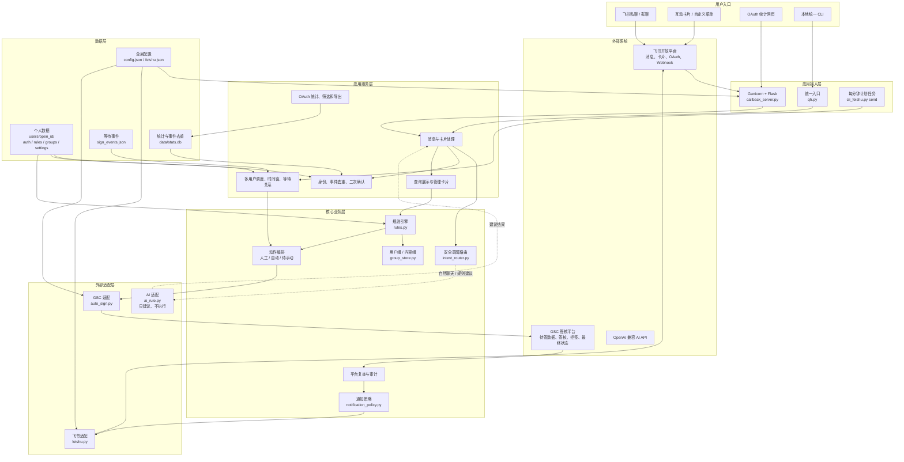

# 飞书签核系统框架

当前版本：`2026.07.28.1400`

本图只描述飞书签核系统的技术框架。主体分区、责任归属和信任边界另见 `系统架构分区.md`。

如果需要按代码实际运行位置区分飞书、公网服务器、公司GSC服务器、AI和本地开发电脑，
请查看 `执行主体与信息流说明.md` 和 `飞书签核系统_执行主体框架图.svg`。

## 1. 技术框架



## 2. 分层说明

| 层级 | 主要作用 | 对应模块 |
|---|---|---|
| 用户入口 | 提供飞书聊天、卡片、菜单、OAuth网页和本地CLI | 飞书客户端、浏览器、`qh.py` |
| 应用接入层 | 接收请求、启动服务、提供统一入口和计划任务 | `callback_server.py`、`qh.py`、`cli_feishu.py` |
| 应用服务层 | 处理消息、身份、去重、确认、多用户调度、查询展示和统计 | `callback_server.py`、`cli.py`、`cli_feishu.py`、`web_dashboard.py` |
| 核心业务层 | 完成安全意图判断、规则匹配、动作编排、通知决策和成功复查 | `intent_router.py`、`rules.py`、`group_store.py`、`notification_policy.py` |
| 外部适配层 | 隔离飞书、GSC和AI接口变化 | `feishu.py`、`auto_sign.py`、`ai_rule.py` |
| 数据层 | 保存全局配置、个人账号与规则、统计和等待事件 | JSON、SQLite |
| 外部系统 | 提供飞书通信、真实签核状态和AI辅助能力 | 飞书开放平台、GSC、OpenAI兼容API |

## 3. 两条业务主链

### 人工交互

```text
飞书消息/卡片
→ 回调接入
→ 身份与事件去重
→ 安全意图路由
→ 查询或明确动作
→ 必要的二次确认
→ GSC提交
→ GSC重新查询验证
→ 统计记录
→ 按通知策略回复或发群
```

### 定时自动处理

```text
每分钟计划任务
→ 遍历用户
→ 检查个人时间窗和间隔
→ 查询GSC
→ 待手动新增提醒
→ 检查自动签核开关
→ 规则匹配和等待关系
→ GSC提交
→ 重新查询验证
→ 统计和通知
```

## 4. 框架外的开发门禁

项目 Skill、`AGENTS.md`、合同测试、统一验证和发布脚本属于开发维护体系，不参与机器人运行时业务链路：

```text
开发需求
→ 项目 Skill 与同步矩阵
→ 修改代码/测试/文档
→ validate-project.ps1
→ build-release.ps1
→ 服务器运行包
```

服务器运行包默认不包含 Skill；维护包才包含 Skill 和本地门禁。
