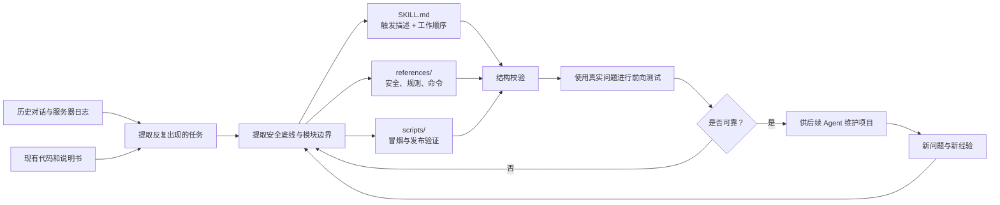

# 如何从飞书自动签核项目开发一个 Skill

## 一、先理解 Skill 的定位

Skill 不是业务程序，也不是把整个项目复制一份。

在本项目中：

- `deploy/auto-sign/` 负责实际接收飞书消息、查询签核平台、执行规则和发送通知；
- `.agents/skills/manage-feishu-signing/` 负责告诉 AI：什么时候应使用这个项目知识、应先读哪些规则、哪些动作危险、修改后怎样测试和打包。

因此，服务器上的飞书机器人不会因为存在 Skill 就自动调用它。只有 Codex、Claude Code 等 Agent 在维护项目时加载了这个 Skill，它才会发挥作用。

## 二、一步步开发 Skill

### 第 1 步：收集真实任务

不要先写 `SKILL.md`，先整理用户实际会提出的问题。

本项目的代表性任务包括：

- “飞书发送消息后为什么没有回复？”
- “新增一条拒签规则，并允许填写拒签理由。”
- “规则卡片按钮点击后没有动作。”
- “暂停自动签核时仍要提醒新增待手动项目。”
- “重新打服务器发布包，但保留旧用户数据。”

这些例子决定 Skill 的触发范围和后续工作流。

**产出：** 5—10 个真实任务样例。

### 第 2 步：提取不可违反的安全规则

从事故、误判和业务要求中提取硬约束。

本项目的核心约束是：

- AI 不直接执行签核、拒签或全量操作；
- 全签、全拒必须二次确认；
- 模拟和测试流程不得提交；
- 群通知必须晚于平台复查；
- 用户数据必须按 `open_id` 隔离；
- 凭证、Key、Token 和用户数据不得进入发布包或日志。

这些内容属于 Skill 的核心规则，应直接写进 `SKILL.md` 或必读的安全参考文件。

**产出：** 安全底线清单。

### 第 3 步：找出可复用知识

分析每类任务需要重复查阅什么：

| 重复需要的知识 | 适合放置位置 |
|---|---|
| 修改项目时的固定顺序 | `SKILL.md` |
| AI 与签核动作的安全边界 | `references/safety-policy.md` |
| 规则、组和通知优先级 | `references/rule-schema.md` |
| CLI 与飞书口语指令 | `references/commands.md` |
| 编译、测试和发布检查 | `scripts/smoke-test.py` |
| 模板、图标或固定输出文件 | `assets/`，仅在确实需要时创建 |

详细资料不要全部塞进 `SKILL.md`。主文件只保留操作顺序和引用入口，需要时再加载对应 reference。

**产出：** Skill 文件结构设计。

### 第 4 步：创建规范目录

Skill 名称应使用小写字母、数字和连字符，最好是动词开头且能说明用途。本项目使用：

```text
manage-feishu-signing
```

规范结构：

```text
.agents/skills/manage-feishu-signing/
├── SKILL.md
├── agents/
│   └── openai.yaml
├── references/
│   ├── safety-policy.md
│   ├── rule-schema.md
│   └── commands.md
└── scripts/
    └── smoke-test.py
```

新 Skill 应使用 `skill-creator` 提供的 `init_skill.py` 初始化。已有 Skill 则跳过初始化，直接检查和更新。

**产出：** 可被 Agent 发现的 Skill 目录。

### 第 5 步：写好触发描述

`SKILL.md` 的 YAML 只需要 `name` 和 `description`。其中 `description` 是最重要的触发条件，必须同时说明：

1. Skill 能做什么；
2. 什么情况下应该使用。

本项目的描述覆盖诊断、维护、测试、部署和扩展飞书签核系统，并列出消息路由、规则、通知、回调、统计和发布包等典型场景。

如果描述只写“飞书工具”，AI 很可能不知道修改规则、部署或排查回调时也应该加载它。

**产出：** 准确的 frontmatter。

### 第 6 步：编写操作工作流

`SKILL.md` 正文应使用命令式语句，告诉另一个 AI 按什么顺序工作。

本项目采用的顺序是：

1. 先读对应的安全、规则或命令参考；
2. 检查相关模块和部署文档；
3. 增加报告问题对应的回归测试；
4. 保持 `qh.py` 统一入口和模块边界；
5. 编译全部 Python 文件；
6. 运行回归测试和冒烟测试；
7. 校验 Skill；
8. 重建发布包并核对内容。

这类容易出事故的项目应采用较低自由度，明确指定验证顺序；普通写作类 Skill 可以给予更高自由度。

**产出：** 简洁、可执行的 `SKILL.md`。

### 第 7 步：把重复动作做成脚本

当同一段检查命令会反复重写，或顺序错误会产生风险时，应放进 `scripts/`。

本项目的 `smoke-test.py` 用于执行基础发布检查。后续还可以将以下动作脚本化：

- 检查压缩包是否包含凭证或用户数据；
- 对比代码、说明书和 `/health` 版本；
- 验证所有必需文件是否在发布包中；
- 检查危险 AI 动作是否重新进入消息路由。

脚本必须实际运行验证，不能只作为示例放在目录中。

**产出：** 确定性验证脚本。

### 第 8 步：验证 Skill

验证分三层：

1. **结构验证**：运行 `quick_validate.py`，检查名称、YAML 和目录格式；
2. **项目验证**：编译代码、运行回归测试和 `smoke-test.py`；
3. **任务验证**：让一个没有历史上下文的 Agent 使用 Skill 处理代表性问题，观察它是否会主动读取正确参考、遵守安全边界并完成测试。

如果只有看过完整历史对话的 Agent 才能正确工作，说明 Skill 没有把关键知识沉淀完整。

**产出：** 验证结果和需要修正的缺口。

### 第 9 步：根据真实使用持续更新

Skill 不是项目完成后一次性编写的说明书。每当发生以下情况都应检查 Skill：

- 出现新的高风险误操作；
- 新增命令、卡片、数据文件或模块；
- 部署步骤发生变化；
- 同一种排查工作反复出现；
- Agent 没有触发 Skill 或读取了错误参考；
- 验证脚本遗漏了实际事故。

更新顺序应是“真实问题 → 提炼通用规律 → 更新 Skill 或 reference → 增加测试 → 再次验证”，而不是把完整聊天记录复制进 Skill。

## 三、这个项目是如何沉淀成 Skill 的



## 四、判断哪些内容该放进 Skill

可以用下面四个问题判断：

1. **另一个 AI 不看历史对话是否容易做错？**  
   容易做错的业务知识应进入 Skill 或 reference。

2. **这个步骤是否每次都要重复？**  
   重复且确定的动作应考虑做成脚本。

3. **这是不是用户数据或运行配置？**  
   账号、密码、Key、Token、个人规则和统计数据不能放进 Skill。

4. **这是 AI 维护项目需要的，还是普通用户使用机器人需要的？**  
   前者进入 Skill，后者进入项目说明书和飞书帮助卡片。

## 五、最小可用 Skill 标准

一个可用的项目 Skill 至少应满足：

- 名称和目录符合规范；
- `description` 能覆盖真实触发场景；
- 正文说明必读资料、操作步骤和验证步骤；
- 高风险动作有明确禁止或确认规则；
- 详细知识通过 references 渐进加载；
- 重复且脆弱的检查有可运行脚本；
- 不包含任何真实凭证和个人数据；
- 已通过结构校验和至少一个真实任务验证。

