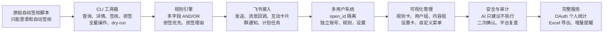
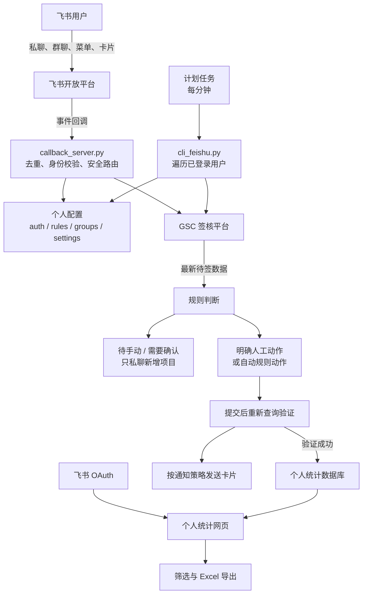
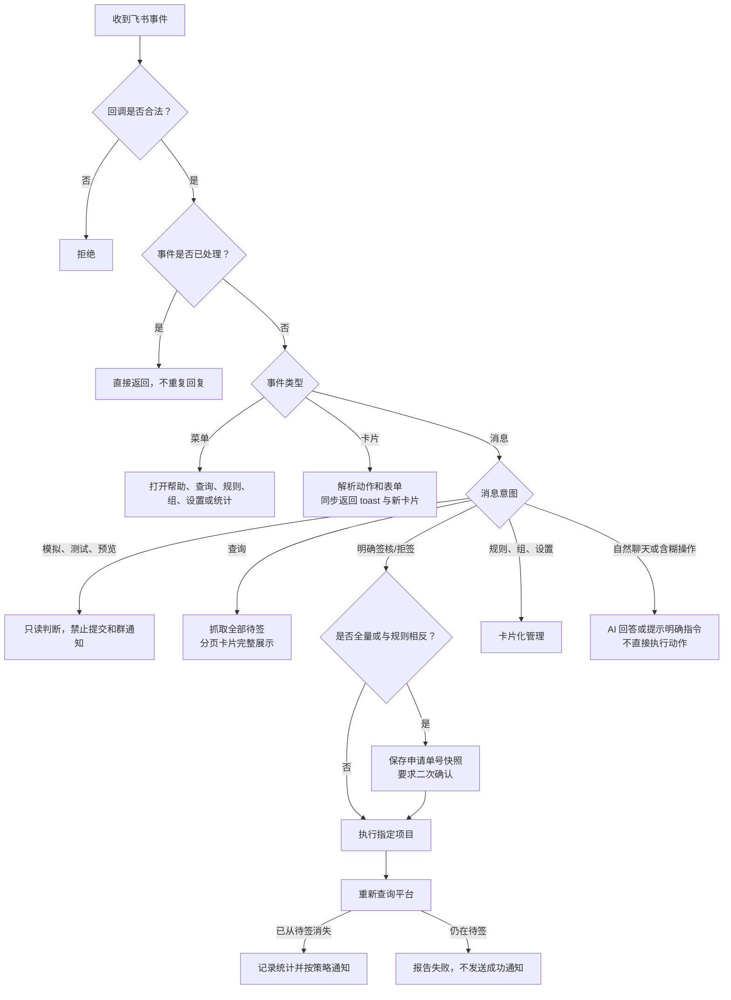
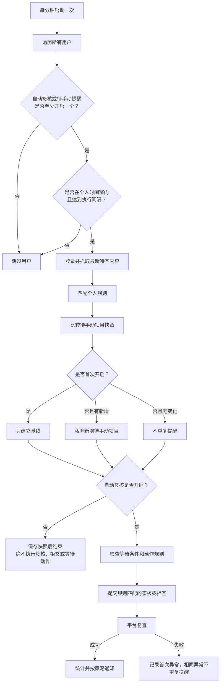

# 飞书自动签核工具开发流程总图

> 本图依据 `完整对话_原档.txt` 和当前项目代码整理。对话编号包含工具结果与日志，不能简单当作独立需求轮数。

## 1. 开发演进

## 2. 关键设计转变

| 早期方案 | 现场问题 | 当前方案 |
|---|---|---|
| 规则写在代码里 | 每次业务调整都要改程序 | `rules.json` 数据化规则 |
| 白名单/黑名单文本文件 | 多名单难维护、名称不可复用 | 用户组和内容组，规则引用组名 |
| AI 可输出执行动作 | 模拟和疑问句可能被误判 | AI 仅建议明确命令，永不直接签核 |
| 操作提交后立即通知 | 接口成功不等于平台状态成功 | 重新查询验证后才统计和通知 |
| 所有人共用配置 | 账号、规则和数据可能串用 | 以飞书 `open_id` 完整隔离 |
| 自动签核停止即不再查询 | 无法获知新增的待手动内容 | 待手动提醒作为独立只读开关 |
| 所有成功操作统一发群 | 群消息过多且不够灵活 | 手动指定、通知规则、动作规则、默认值四级策略 |

## 3. 当前系统架构

## 4. 飞书消息处理

## 5. 定时任务

## 6. 当前安全底线

- AI 永远不直接执行签核、拒签、全签或全拒。
- 全签和全拒始终按申请单号快照进行二次确认。
- 人工操作与匹配规则相反时必须再次确认。
- 模拟、测试、预览流程不得提交，也不得发送成功群通知。
- 未匹配通知规则时默认不发送群通知。
- 只有平台重新查询验证成功的动作才能进入个人统计。
- OAuth 统计必须在服务端按当前飞书 `open_id` 过滤。
- 待手动提醒可以在自动签核停止时运行，但只能查询和私聊提醒。

## 7. 配套材料

- 主体分区系统架构：`deploy/系统架构分区.md`
- 图片版：`开发流程图谱.svg`
- Skill 开发步骤图片：`Skill开发步骤流程图.svg`
- Skill 开发分析：`如何开发Skill_分析.md`
- 简易报告：`开发经历与使用心得报告.md`
- 原始资料：`完整对话_原档.txt`
- 运行流程：`deploy/流程图.md`
- 综合说明：`deploy/说明书.md`
