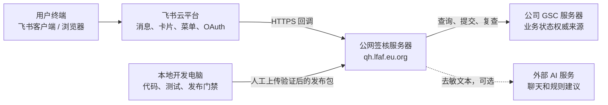
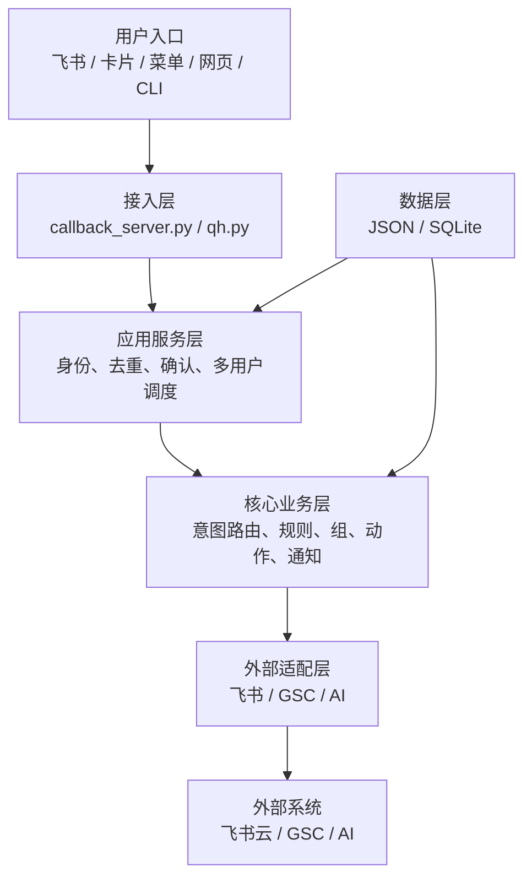
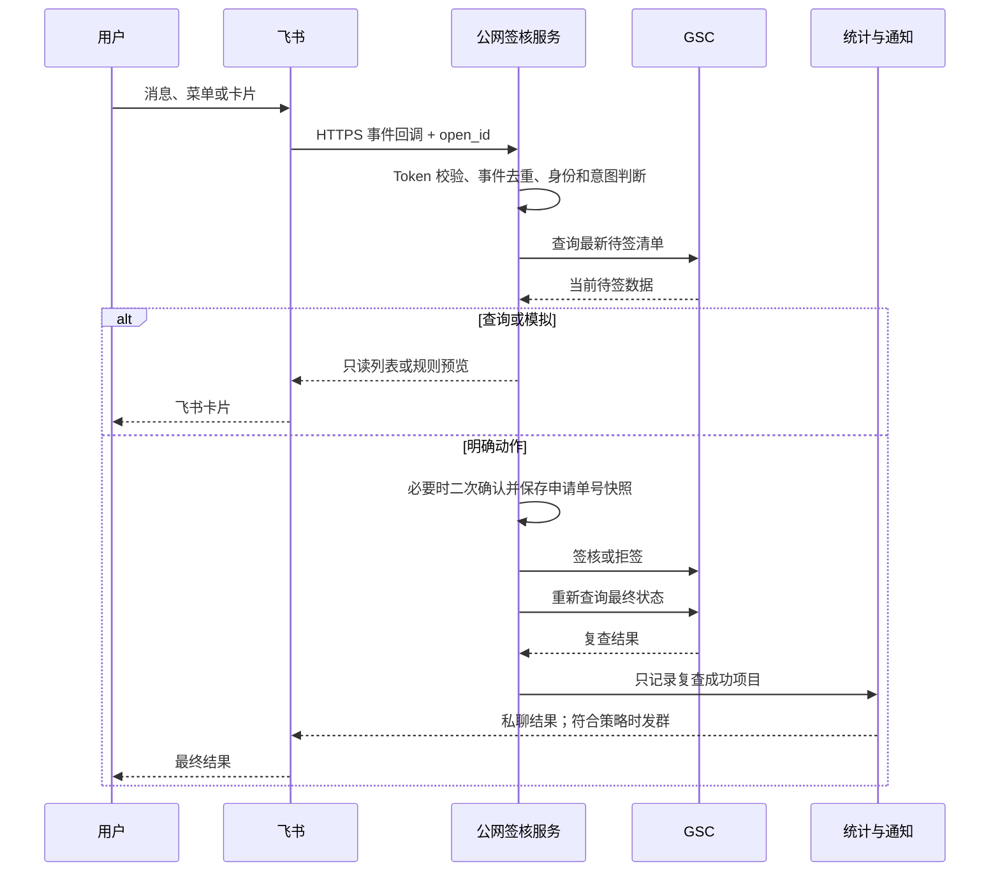
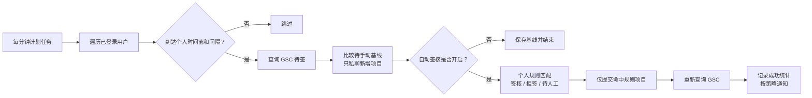

# 飞书签核系统建设与运行情况报告

**汇报对象：** 公司管理层  
**报告日期：** 2026 年 7 月 28 日  
**当前软件版本：** `2026.07.27.1800`  
**报告口径：** 基于当前项目代码、部署说明、系统说明和自动化测试结果；未读取个人账号、生产规则或业务统计明细。

---

## 一、管理层摘要

这套系统已经把原来需要人员反复登录 GSC、查询待办、逐项判断和通知的流程，整合为一个以飞书为入口的多用户签核工具箱。用户可以在飞书中查询、预览、维护个人规则、执行明确的人工操作，也可以按个人时间和规则自动处理；所有真实签核结果仍以公司 GSC 平台为准。

系统的核心价值不是“让 AI 自动替人审批”，而是：

1. **统一入口：** 用户主要在飞书完成查询、设置、确认和结果查看，减少系统切换。
2. **规则自动化：** 对明确、重复、可标准化的业务条件进行自动签核或拒签；未命中规则的项目保留人工处理。
3. **风险可控：** AI 只用于自然语言理解和规则建议，不允许直接发起签核、拒签、全签或全拒。
4. **结果可信：** 提交动作后必须重新查询 GSC；只有 GSC 复查确认成功，才记入统计并允许发群通知。
5. **用户隔离：** 每名飞书用户的账号、规则、设置和统计按 `open_id` 隔离，统计网页通过飞书 OAuth 确认当前身份。
6. **具备维护门禁：** 当前版本已通过 43 项回归测试、7 项合同测试和安全冒烟检查，代码、说明、Skill 和发布流程有统一校验。

目前系统已经形成可运行闭环，但生产保障仍属于“单机应用”水平：公网服务器采用单实例 Gunicorn、分钟级计划任务、本地 JSON/SQLite 存储。下一阶段建议优先补齐凭证保护、GSC HTTPS 证书校验、备份恢复、运行监控和故障切换能力，再扩大使用范围。

---

## 二、建设背景与目标

### 2.1 业务痛点

传统签核流程通常包含登录 GSC、查询待签清单、判断是否符合规则、逐项操作、确认最终结果、再通知相关人员等环节。主要问题是：

- 重复查询和重复判断占用人员时间；
- 多名用户的规则、时间和通知需求不同，难以用一套固定脚本覆盖；
- 直接自动化容易出现误签、重复执行和“提交成功但业务状态未成功”的风险；
- 群内协作、个人凭证、规则和统计之间需要清晰隔离；
- 系统更新时必须避免覆盖用户凭证、个人规则和历史统计。

### 2.2 建设目标

系统围绕“便捷、可控、可追溯”建设：

- 以飞书作为主要交互入口；
- 以确定性规则作为动作判断依据；
- 以 GSC 作为业务结果的唯一权威来源；
- 以用户确认、安全路由和平台复查控制误操作；
- 以个人统计和通知记录形成可追溯闭环；
- 以测试和发布门禁保证升级质量。

---

## 三、硬件与部署架构

### 3.1 当前实际部署拓扑



### 3.2 各硬件/平台主体

| 主体 | 当前职责 | 当前已知部署信息 |
|---|---|---|
| 用户终端 | 飞书交互、卡片确认、访问统计网页 | PC 或移动端飞书、浏览器 |
| 飞书云平台 | 消息投递、卡片、菜单、OAuth 身份、群 Webhook | 飞书开放平台托管 |
| 公网签核服务器 | 运行全部 Python 业务代码、个人数据、规则、调度和统计网页 | 域名 `qh.lfaf.eu.org`；Linux/宝塔；Python 3.9.7；Gunicorn 单 Worker；监听 7000；外部 HTTPS |
| 公司 GSC 服务器 | 提供待签数据、接收签核/拒签、保存最终状态 | 公司业务系统；由公网服务器发起会话 |
| 外部 AI 服务器 | 可选的自然语言聊天和规则解析 | OpenAI 兼容 HTTPS API；不参与真实动作执行 |
| 本地开发电脑 | 代码维护、回归测试、发布包生成 | 发布前执行统一验证；人工部署到公网服务器 |

### 3.3 公网服务器内部运行结构

```text
Nginx / HTTPS
    │
    ├─ /feishu/event
    ├─ /stats/*
    └─ /health
         │
Gunicorn -w 1 -b 0.0.0.0:7000
         │
Flask callback_server.py
         │
         ├─ 消息、卡片、菜单与 OAuth
         ├─ 身份、去重、确认与安全意图路由
         ├─ 规则、组、通知和动作编排
         └─ GSC 平台适配与结果复查

每分钟计划任务
    └─ qh.py feishu send
         └─ 遍历已登录用户并按个人设置调度

本机数据
    ├─ users/<open_id>/  个人凭证、规则、组、设置
    ├─ data/stats.db     成功动作统计与事件去重
    ├─ sign_events.json  等待关系事件
    ├─ config.json       GSC 连接配置
    └─ feishu.json       飞书、OAuth、AI 配置
```

### 3.4 尚未掌握的硬件参数

代码仓库没有记录生产服务器的 CPU、内存、系统盘、数据盘、带宽、机房、备份策略和可用性 SLA。本报告不对这些参数作假设。正式评审时建议补充：

- 云主机或物理机规格；
- 峰值用户数、每日待签量和并发量；
- 磁盘使用量及增长速度；
- GSC 与公网服务器之间的网络可达性和稳定性；
- 备份频率、保留周期、恢复时间目标；
- 域名、证书、服务器和运维责任人。

---

## 四、软件架构

系统采用分层、模块化结构，避免把飞书、规则、GSC 和统计逻辑混在一起。



| 区域 | 主要模块 | 作用 |
|---|---|---|
| 统一入口 | `qh.py` | 提供稳定的签核、飞书和网页 CLI 入口 |
| 飞书接入 | `callback_server.py`、`feishu.py` | 接收消息、卡片和菜单事件；发送回复与群通知 |
| 安全路由 | `intent_router.py` | 区分预览、查询、解释、规则建议和潜在动作 |
| 多用户调度 | `cli_feishu.py`、`user_manager.py` | 按用户检查时间窗、间隔、暂停、提醒和等待关系 |
| 规则决策 | `rules.py`、`group_store.py` | 判断自动签核、自动拒签或待人工，并管理用户组/内容组 |
| 通知决策 | `notification_policy.py` | 独立判断是否发群，不改变签核动作 |
| GSC 适配 | `auto_sign.py`、`cli.py` | 登录、抓取、解析、提交、重新查询和 CLI 操作 |
| AI 辅助 | `ai_rule.py` | 自然语言与规则解析建议；不直接执行动作 |
| 统计与网页 | `stats_store.py`、`web_dashboard.py` | 个人统计、筛选、趋势、明细、Excel 导出和网页管理 |

---

## 五、端到端信息流

### 5.1 用户人工查询和操作



关键控制点：

- 回调先校验飞书 `verification_token`；
- `message_id/event_id` 写入 SQLite，10 分钟内重复投递不再次执行；
- “模拟、测试、预览、试跑”固定进入只读流程；
- 全签、全拒始终二次确认；
- 与已命中规则相反的人工操作需要二次确认；
- 确认时按申请单号快照重新查询，不按可能已经变化的列表序号执行。

### 5.2 定时自动处理



自动链路的三个特点：

1. 每名用户使用自己的 GSC 凭证、规则、时间、间隔和通知设置。
2. “待手动提醒”和“自动签核”是独立开关；关闭自动签核后，提醒链路仍只能查询和私聊，不能执行动作。
3. 未命中签核或拒签规则的项目始终保留为待人工，系统不会为了完成自动任务而强行动作。

### 5.3 等待关系

用户可以设置等待其他一个或多个已登录用户。任意一人真实完成签核或拒签后，系统延时重新查询，再按等待者当前规则运行一轮。该机制采用“任意一人完成即触发”，触发后自动清除；未命中规则的项目仍保持待人工。

系统会检查直接或间接等待关系，避免形成循环等待。

### 5.4 OAuth 统计网页

```text
飞书“统计”入口
→ 跳转公网统计网页
→ 飞书 OAuth 登录
→ 服务端获得当前 open_id
→ 所有查询、修改、导出固定按该 open_id 过滤
→ 页面展示统计、规则、组和设置
```

网页不接受用户通过 URL 自由指定 `open_id`；所有修改请求使用 CSRF 校验，降低跨用户读取和跨站修改风险。

### 5.5 AI 信息流

```text
用户自然语言
→ 安全意图路由
→ 去敏后的必要文本
→ 可选 AI 服务
→ 聊天回复、规则建议或明确指令建议
→ 用户决定是否采用
```

AI 输出不能直接进入 GSC 动作接口。即使 AI 判断用户想签核或拒签，系统也只提示用户使用确定性指令。

---

## 六、规则、动作和通知机制

### 6.1 动作分类

系统按个人规则将项目分为：

- 自动拒签；
- 自动签核；
- 待人工处理。

动作优先级为：

```text
自动拒签 > 自动签核 > 待人工
```

规则可基于申请人、描述、类别、单位和申请单号，并支持等于、包含、前缀、正则、名单、用户组和内容组等条件。用户组适合管理人员名单，内容组适合管理料号前缀或业务关键词。

### 6.2 通知与动作相互独立

是否发群不会改变签核动作，固定按以下优先级决策：

```text
人工明确“发群/不发群”
> 独立通知规则
> 动作规则的通知设置
> 个人默认值（默认不发群）
```

只有 GSC 复查成功的项目才能发群。签核和拒签使用不同颜色卡片，拒签逐项展示原因。

---

## 七、数据分区与安全边界

### 7.1 数据所有权

| 数据 | 存储位置 | 所有权和用途 |
|---|---|---|
| GSC 地址、超时、SSL 设置 | `config.json` | 系统级连接配置 |
| 飞书 App、OAuth、AI 配置 | `feishu.json` | 系统级密钥与入口配置 |
| 用户 GSC 凭证 | `users/<open_id>/auth.json` | 仅该用户动作使用 |
| 个人规则和组 | `rules.json`、`groups.json` | 仅该用户决策使用 |
| 个人设置 | `settings.json` | 时间、间隔、暂停、提醒、等待和通知默认值 |
| 统计与事件去重 | `data/stats.db` | 共享数据库，但查询必须按 `open_id` 隔离 |
| GSC 业务状态 | 公司 GSC 服务器 | 最终权威数据 |

旧版全局 `sign_records.xlsx` 不包含可靠的 `open_id`，因此系统不会自动导入个人统计，避免把历史记录错误归属给某个用户。

### 7.2 六条核心信任原则

1. 飞书事件必须先做来源校验和事件去重。
2. 用户身份以飞书事件或 OAuth 返回的 `open_id` 为准。
3. AI 输出不可信，只能提供建议，不能直接执行。
4. 预览和测试只能读，不能写。
5. GSC 是最终状态权威来源，提交响应不能单独证明成功。
6. 只有平台复查成功的动作才能统计或发群。

---

## 八、运行与维护机制

### 8.1 当前运行方式

- Flask/Gunicorn 提供飞书回调、健康检查和统计网页；
- 每分钟计划任务触发多用户调度；
- 正常模式关闭详细访问日志，只保留启动、失败和必要诊断；
- 相同自动签核异常持续发生时只提醒一次，出现成功后才重新允许同类告警；
- `/health` 返回版本和安全能力标志，可用于部署后检查。

### 8.2 发布门禁

```text
需求变更
→ 判断影响范围
→ 修改代码、测试和必要文档
→ validate-project.ps1
→ 回归测试、合同测试、安全冒烟和敏感内容检查
→ build-release.ps1
→ 人工上传部署
```

发布包默认不包含真实 `feishu.json`、`config.json`、用户目录、统计数据库、日志和历史 Excel，因此覆盖升级不会替换服务器密钥、个人规则、凭证或统计。

### 8.3 本次核验结果

2026 年 7 月 28 日在当前代码上执行统一验证，结果：

- 43 项业务与安全回归测试通过；
- 7 项 Skill/版本/发布合同测试通过；
- 飞书签核安全冒烟检查通过；
- 项目 Skill 结构校验通过；
- 官方 Skill 快速校验因本机缺少 PyYAML 未执行，但项目自带的无依赖校验已通过。

这说明当前代码与项目内说明、测试和安全合同一致；它不等同于生产服务器的实时健康检查或生产业务验收。

---

## 九、对公司的价值

### 9.1 已具备的价值

| 维度 | 体现 |
|---|---|
| 效率 | 飞书统一入口、定时查询、规则自动判断、增量提醒，减少重复登录和人工巡检 |
| 规范 | 规则、确认、拒签原因和通知优先级固定，降低人员操作差异 |
| 风险 | AI 与真实动作隔离；全量动作二次确认；GSC 复查后才算成功 |
| 协同 | 私聊处理个人事项，群聊只发布已验证结果；支持等待关系和指定人员单次自动处理 |
| 管理 | 个人统计、筛选、趋势、明细和 Excel 导出，为后续效率与质量分析提供基础 |
| 可维护 | 分层模块、回归测试、合同测试和发布门禁，降低升级引入事故的概率 |

### 9.2 暂不能量化的收益

仓库不包含可用于本报告的生产统计基线，因此暂不能准确给出：

- 每月减少多少人工工时；
- 自动处理率、平均处理时长和峰值吞吐；
- 误签率、失败率、重试率和异常恢复时长；
- 各部门或各用户的使用覆盖率。

建议从个人统计库提取脱敏、汇总口径，建立“上线前后”对比，后续用数据回答投入产出。

---

## 十、风险、限制与改进建议

### 10.1 当前主要风险

| 优先级 | 风险或限制 | 当前情况 | 建议 |
|---|---|---|---|
| 高 | GSC 证书校验 | 示例配置默认 `verify_ssl: false` | 优先部署有效证书并启用校验；如受内网证书限制，应配置受信 CA，而不是长期关闭校验 |
| 高 | 用户凭证保护 | GSC 用户名和密码保存在个人 `auth.json` | 引入操作系统权限、加密存储或密钥服务；制定凭证轮换和离职清理流程 |
| 高 | 单机故障 | Gunicorn 单 Worker、本地 JSON/SQLite、单台公网服务器 | 增加数据备份和恢复演练；评估双机、热备或容器化部署 |
| 高 | 生产可观测性 | 当前以精简日志和异常提醒为主 | 增加健康探测、任务成功率、GSC 延迟、失败率、磁盘和证书到期监控 |
| 中 | 数据备份 | 仓库中未体现生产备份方案 | 对 `users/`、`data/` 和必要配置做加密备份，明确恢复时间和保留周期 |
| 中 | 容量依据 | 缺少并发、待签量和资源数据 | 建立容量基线并做压力测试，再决定 Worker、CPU、内存和数据库方案 |
| 中 | 外部 AI 数据边界 | AI 为可选外部服务 | 明确允许发送的字段、脱敏规则、供应商留存策略和关闭开关 |
| 中 | Python 版本生命周期 | 当前文档使用 Python 3.9.7 | 评估升级到受支持版本并完成兼容回归 |
| 中 | 业务验收指标 | 代码验证通过，但缺生产 KPI | 建立自动处理率、人工接管率、失败率、节省工时和误操作指标 |

### 10.2 建议分阶段推进

**第一阶段：生产安全加固**

- 启用 GSC HTTPS 证书验证；
- 加固用户凭证和系统密钥存储；
- 建立加密备份、恢复演练和离职账号清理；
- 增加健康检查、任务失败、证书、磁盘和接口延迟监控。

**第二阶段：稳定性与运营数据**

- 建立生产 KPI 看板；
- 统计自动处理率、待人工率、失败率和平均处理时长；
- 根据真实负载调整 Gunicorn Worker、计划任务和数据库；
- 建立变更审批、灰度发布和回滚流程。

**第三阶段：规模化应用**

- 在明确规则和责任边界后扩大用户范围；
- 把高频、低争议场景沉淀为标准规则模板；
- 对跨部门规则建立业务负责人审核机制；
- 评估高可用部署、集中数据库和统一密钥管理。

---

## 十一、建议管理层决策

建议管理层确认以下三项：

1. **系统定位：** 将其定位为“规则驱动、人工可控、GSC 结果复核”的签核辅助与自动化平台，而不是 AI 自主审批系统。
2. **投产标准：** 扩大范围前，以证书校验、凭证保护、备份恢复和监控告警作为安全前置条件。
3. **价值评价：** 批准建立脱敏运营指标，以自动处理率、平均处理时长、失败率、人工节省工时和规则覆盖率评价项目成效。

---

## 十二、五分钟汇报话术

这套系统的目标，是把 GSC 签核中大量重复查询、重复判断和结果通知工作，统一放到飞书里完成。

从架构上看，用户在飞书发消息或点卡片，飞书把事件通过 HTTPS 送到公网签核服务器。服务器根据当前用户身份加载他自己的账号、规则和设置，再连接公司 GSC 查询或执行。真实结果不以程序的提交响应为准，而是提交后重新查询 GSC；确认业务状态成功以后，才会记统计或发群通知。

系统既支持人工查询和明确签核，也支持按个人时间和规则自动处理。规则没有命中的项目不会强行自动操作，仍然留给人工。全签、全拒以及与规则相反的人工动作都需要二次确认，并按申请单号快照执行，防止列表变化造成错签。

AI 在这套系统里只负责理解自然语言和帮助生成规则，不拥有真实签核权限。即使 AI 判断用户想签核，也只能给出明确指令建议，不能直接调用 GSC。

目前系统已经具备多用户隔离、个人规则、用户组和内容组、自动调度、待手动提醒、群通知策略、OAuth 个人统计网页和 Excel 导出。当前版本通过了 43 项回归测试、7 项合同测试以及安全冒烟检查。

下一步不建议马上只追求更多功能，而应先把生产保障补齐：启用 GSC 证书校验、加强凭证保护、建立加密备份和恢复演练、增加运行监控，并用脱敏数据统计自动处理率、失败率和节省工时。这样才能把现在“可运行”的系统，进一步建设成“可规模化、可审计、可长期运营”的内部平台。

